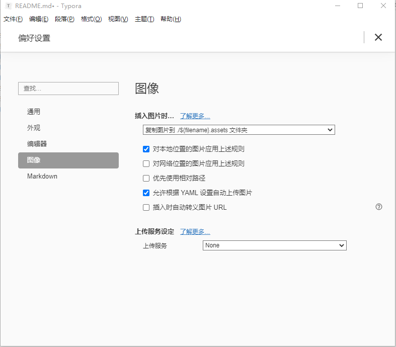

# typora
typora图片设置说明：

菜单【格式】-图像 -全局图像设置

插入图片时，下拉框选择：

复制图片到./${filename}.assets文件夹

勾选两个选项：

- 对本地位置的图片应用上述规则

- 允许根据YAML设置自动上传图片

  

在md文档编辑时键盘同时按住Ctrl+Shift+i可以快速插入图片

然后鼠标单击图片，会弹出图片路径

> ![](E:\typora\typora\README.assets\typora图片偏好设置.png

[]设置图片名称，缺省时会提示蚊子，同时将绝对路径改成相对路径，斜杠统一成/,即

> ![typora图片偏好设置](./README.assets/typora图片偏好设置.png

