[TOC]


# 多线程基础

## 并发和并行

并行是指两个或者多个事件在同一时刻发生；多CPU支持；

并发是指单位时间内能够同时处理的请求数；CPU时间片切换；

默认情况下Tomcat可以支持的最大请求数是150，当超过这个并发数的时候，就会开始导致响应延迟，连接丢失等问题。


## 线程作用

提升服务器端的并发数量（吞吐量）。


## 影响服务器吞吐量的因素

硬件：CPU、内存、磁盘、网络

软件：线程数量、JVM内存分配大小、磁盘IO、网络通信机制（BIO、NIO、AIO）


## JAVA中的线程

- Runnable 接口

  ```java
  public interface Runnable {
      public abstract void run();
  }
  ```

- Thread 类

- Callable 接口

  ```java
  public interface Callable<V> {
      V call() throws Exception;
  }
  ```

- ExecutorService 接口 线程池

  四种线程池

  `newCachedThreadPool`创建一个可缓存线程池，如果线程池长度超过处理需要，可灵活回收空闲线程，若无可回收，则新建线程。

1. ```java
   ExecutorService cachedThreadPool = Executors.newCachedThreadPool();
   for (int i = 0; i < 10; i++) {
       final int index = i;
       try {
           Thread.sleep(index * 1000);
       } catch (InterruptedException e) {
           e.printStackTrace();
       }
       
       cachedThreadPool.execute(()->{
                   System.out.println(index);
       });
   }
   ```

   > 线程池为无限大，当执行第二个任务时第一个任务已经完成，会复用执行第一个任务的线程，而不用每次新建线程。

2. `newFixedThreadPool` 创建一个定长线程池，可控制线程最大并发数，超出的线程会在队列中等待。

   ```java
   ExecutorService fixedThreadPool = Executors.newFixedThreadPool(3);
       for (int i = 0; i < 10; i++) {
           final int index = i;
           fixedThreadPool.execute(()->{
               try {
                   System.out.println(index);
                   Thread.sleep(2000);
               } catch (InterruptedException e) {
                   e.printStackTrace();
               }
           });
   }
   ```

   > 因为线程池大小为3，每个任务输出index后sleep 2秒，所以每两秒打印3个数字。
   > 定长线程池的大小最好根据系统资源进行设置。如Runtime.getRuntime().availableProcessors()。可参考PreloadDataCache。

3. `newScheduledThreadPool` 创建一个定长线程池，支持定时及周期性任务执行。

   ```java
   ScheduledExecutorService scheduledThreadPool = Executors.newScheduledThreadPool(5);
   
   // 表示延迟3秒执行
   scheduledThreadPool.schedule(()->{
       System.out.println("delay 3 seconds");
   }, 3, TimeUnit.SECONDS);
   
   // 表示延迟1秒后每3秒执行一次
   scheduledThreadPool.scheduleAtFixedRate(()-> {
       System.out.println("delay 1 seconds, and excute every 3 seconds");
   }, 1, 3, TimeUnit.SECONDS);
   ```

4. `newSingleThreadExecutor` 创建一个单线程化的线程池，它只会用唯一的工作线程来执行任务，保证所有任务按照指定顺序(FIFO, LIFO, 优先级)执行。

   ```java
   ExecutorService singleThreadExecutor = Executors.newSingleThreadExecutor();
   for (int i = 0; i < 10; i++) {
       final int index = i;
       singleThreadExecutor.execute(()-> {
           try {
               System.out.println(index);
               Thread.sleep(2000);
           } catch (InterruptedException e) {
               e.printStackTrace();
           }
       });
   }
   ```

   

## Thread应用场景

- 网络请求分发的场景
- 文件导入
- 短信发送场景


## Java线程生命周期

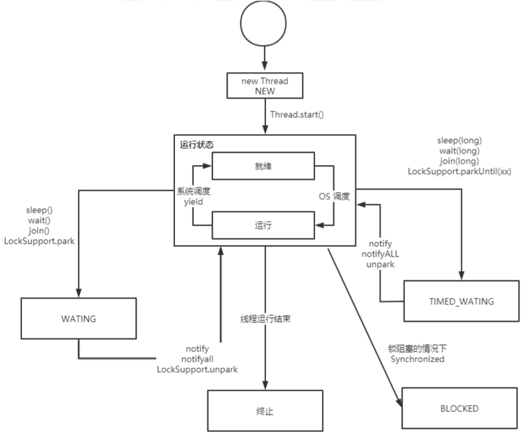

需要注意的是，操作系统中的线程除去 new 和 terminated 状态，一个线程真实存在的状态，只有：

- `ready` ：表示线程已经被创建，正在等待系统调度分配CPU使用权。 

- `running` ：表示线程获得了CPU使用权，正在进行运算 

- `waiting` ：表示线程等待（或者说挂起），让出CPU资源给其他线程使用

在加上新建状态和死亡状态，一共5种


## 线程的启动

```java
new Thread(()->{
    System.out.println("启动线程");
}).start();
```

> start启动线程，run调用实例方法

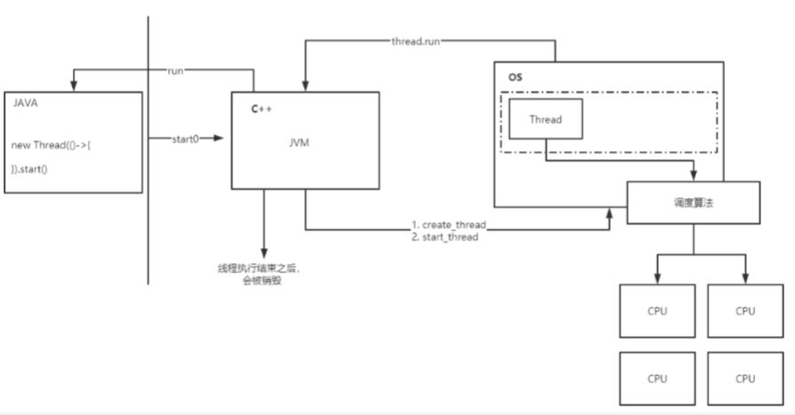

## 线程的终止

> 线程什么情况下会终止

run方法执行结束 volatile jint _interrupted;     <!--Thread.isInterrupted state-->

```c
void os::interrupt(Thread* thread) {  
    assert(Thread::current() == thread || Threads_lock->owned_by_self(),    
           "possibility of dangling Thread pointer");
  OSThread* osthread = thread->osthread();
  if (!osthread->interrupted()) {    
      osthread->set_interrupted(true); //设置一个中断状态    
      // More than one thread can get here with the same value of osthread,    
      // resulting in multiple notifications.  We do, however, want the store    
      // to interrupted() to be visible to other threads before we execute unpark().   
      OrderAccess::fence();    
      ParkEvent * const slp = thread->_SleepEvent ;//如果是sleep中，唤醒    
      if (slp != NULL) slp->unpark() ;  
  }
   // For JSR166. Unpark even if interrupt status already was set  
   if (thread->is_Java_thread())    ((JavaThread*)thread)->parker()->unpark();
   ParkEvent * ev = thread->_ParkEvent ;  if (ev != NULL) ev->unpark() ;
}
```


## interrupt()的作用 

- 设置一个共享变量的值 true 

- 唤醒处于阻塞状态下的线程

  只有唤醒状态下的线程,JVM抛出InterruptedException异常才能被线程捕获,从而做出响应(中断线程,抛出异常或者不处理)

> 正确的终止线程不是由外部去决定,而是将终止决定权交由程序线程自己决定,而非强制终止.

> 所有线程阻塞操作(sleep/wait/join)都要捕获InterruptedException以对中断作出响应处理

```java
Thread thread = new Thread(()->{
    while (!Thread.currentThread().isInterrupted()){
    }
    System.out.println("线程结束");
});
thread.start();
// 发起中断请求
thread.interrupt();
```

> 号外号外：：
>
> ReentrantLock

# 线程安全

线程安全：

- 原子性：线程不允许被中断
- 有序性：
- 可见性：其导致可见性问题有两个因素，一个是高速缓存导致的可见性问题，另一个是指令重排序。

## 原子性、可见性案例

```java
public static int count = 0 ;

public static void incr(){
    try {
        Thread.sleep(1000);
        count ++;
    } catch (InterruptedException e) {
        e.printStackTrace();
    }
}
public static void main(String[] args) {
    for(int i = 0 ;i < 1000 ; i++){
        new Thread(()->{
            incr();
        }).start();
    }
    try {
        Thread.sleep(3000);
    } catch (InterruptedException e) {
        e.printStackTrace();
    }
    System.out.println(count);
}
```

结果是小于等于1000的随机数

原因：可见性、原子性

## 非原子性：count++指令

```assembly
14: getstatic     #5  // Field count:I 
15: iconst_1 
16: iadd 
17: putstatic     #5 
```

多线程环境中，CPU切换上下文，count++指令可能被中断，因此会出现


## 同步锁Synchronized

> 互斥锁的本质：共享资源。

- 类锁（作用范围大，性能开销大）
- 对象锁


### 锁的作用范围

synchronized有三种方式来加锁，不同的修饰类型，代表锁的控制粒度：

1. 修饰实例方法，作用于当前实例加锁，进入同步代码前要获得当前实例的锁 
2. 静态方法，作用于当前类对象加锁，进入同步代码前要获得当前类对象的锁
3. 修饰代码块，指定加锁对象，对给定对象加锁，进入同步代码库前要获得给定对象的锁。

### 锁的存储（对象头）：

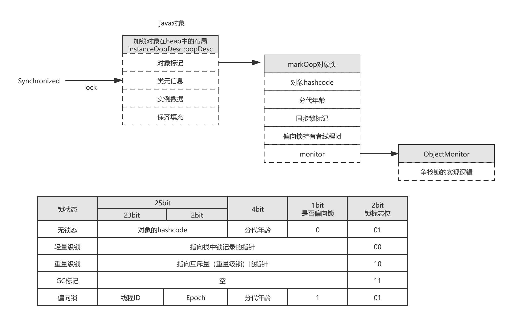

> 如果偏向锁打印hashcode,会升级为重量级锁,因为偏向锁没有空间可以保存hashcode


### 打印类的布局

```xml
 <dependency>      
     <groupId>org.openjdk.jol</groupId>      
     <artifactId>jol-core</artifactId>      
     <version>0.10</version>    
</dependency>
```

通过打印加锁类来查看对象头 

```java
SynchronizedTest classLayoutDemo = new SynchronizedTest();
synchronized (classLayoutDemo){
    System.out.println("locking");
    System.out.println(ClassLayout.parseInstance(classLayoutDemo).toPrintable());
}
```

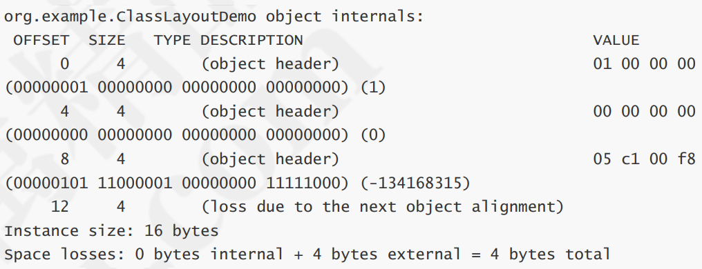

小端存储,对象头16进制: 0x 00 00 00 00 00 00 00 01

> 大端存储和小端存储

在CPU内部的地址总线和数据总线是与内存的地址总线和数据总线连接在一起的。当一个数从内存中向CPU传送时，有时是以字节为单位，有时又以字（4字节）为单位。传过来是放在寄存器里（一般是32字节），在寄存器中，一个字的表示是右边应该属于低位，左边属于高位，如果寄存器的高位和内存中的高地址相对应，低位和内存的低地址相对应，这就属于小端存储。反之则称为大端存储。大部分处理器都是小端存储的。

因为十六进制的2位正好是1字节，所以选十六进制0x01000000为例，如图所示，对小端存储，低位是0x01，应存入低位地址，所以存入的顺序是

```c
0x00 0x00 0x00 0x01
```

反之，对于大端存储则为

```c
0x01 0x00 0x00 0x00 
```


### 锁的升级

锁升级：

偏向锁 -> 轻量级锁（乐观锁，自旋锁） ->  重量级锁（ 监视器）

CAS          多次CAS

> 线程获得锁和释放锁时间很短暂，因此通过自旋（CAS）很大概率可以获得锁
>
> 自旋可能带来CPU性能开销，因此需要控制自旋次数
>
> JDK1.6以前默认自旋10次
>
> JDK1.6以后自适应自旋

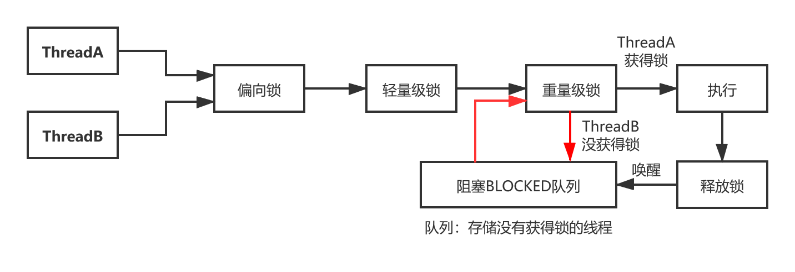

### 偏向锁

在大多数情况下，锁不仅仅不存在多线程的竞争，而且总是由同一个线程多次获得。在这个背景下就设 计了偏向锁。偏向锁，顾名思义，就是锁偏向于某个线程。
当一个线程访问加了同步锁的代码块时，会在对象头中存储当前线程的ID，后续这个线程进入和退出这 段加了同步锁的代码块时，不需要再次加锁和释放锁。而是直接比较对象头里面是否存储了指向当前线 程的偏向锁。如果相等表示偏向锁是偏向于当前线程的，就不需要再尝试获得锁了，引入偏向锁是为了 在无多线程竞争的情况下尽量减少不必要的轻量级锁执行路径。（偏向锁的目的是消除数据在无竞争情 况下的同步原语，进一步提高程序的运行性能。）

### 轻量级

如果偏向锁被关闭或者当前偏向锁已经已经被其他线程获取，那么这个时候如果有线程去抢占同步锁时，锁会升级到轻量级锁。 

### 重量级锁

- 多个线程竞争同一个锁的时候，虚拟机会阻塞加锁失败的线程，并且在目标锁被释放的时候，唤醒 这些线程；

- Java 线程的阻塞以及唤醒，都是依靠操作系统来完成的：os pthread_mutex_lock() ； 

- 升级为重量级锁时，锁标志的状态值变为“10”，此时Mark Word中存储的是指向重量级锁的指针，此时等待锁的线程都会进入阻塞状态

每一个JAVA对象都会与一个监视器monitor关联，我们可以把它理解成为一把锁，当一个线程想要执行 一段被synchronized修饰的同步方法或者代码块时，该线程得先获取到synchronized修饰的对象对应的monitor。 monitorenter表示去获得一个对象监视器。monitorexit表示释放monitor监视器的所有权，使得其他被阻塞的线程可以尝试去获得这个监视器
monitor依赖操作系统的MutexLock(互斥锁)来实现的,线程被阻塞后便进入内核（Linux）调度状态，这 个会导致系统在用户态与内核态之间来回切换，严重影响锁的性能
任意线程对Object（Object由synchronized保护）的访问，首先要获得Object的监视器。如果获取失败，线程进入同步队列，线程状态变为BLOCKED。当访问Object的前驱（获得了锁的线程）释放了锁，则该释放操作唤醒阻塞在同步队列中的线程，使其重新尝试对监视器的获取。

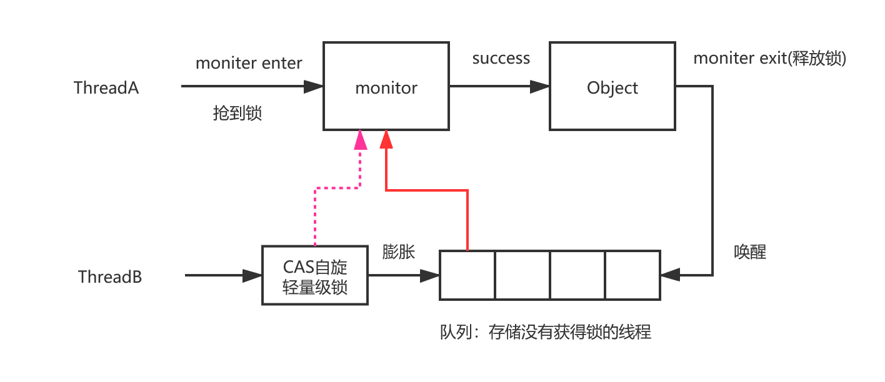


**总结** 

- 偏向锁只有在第一次请求时采用CAS在锁对象的标记中记录当前线程的地址，在之后该线程再次进 入同步代码块时，不需要抢占锁，直接判断线程ID即可，这种适用于锁会被同一个线程多次抢占 的情况。 

- 轻量级锁才用CAS操作，把锁对象的标记字段替换为一个指针指向当前线程栈帧中的 LockRecord，该工件存储锁对象原本的标记字段，它针对的是多个线程在不同时间段内申请通一 把锁的情况。

- 重量级锁会阻塞、和唤醒加锁的线程，它适用于多个线程同时竞争同一把锁的情况。


## 线程的通信(wait/notify）

在Java中提供了wait/notify这个机制，用来实现条件等待和唤醒。这个机制我们平时工作中用的少，但是在很多底层源码中有用到。

比如以抢占锁为例，假设线程A持有锁，线程B再去抢占锁时，它需要等待持有锁的线程释放之后才能抢占，那线程B怎么知道线程A什么时候释放呢？

这个时候就可以采用通信机制。

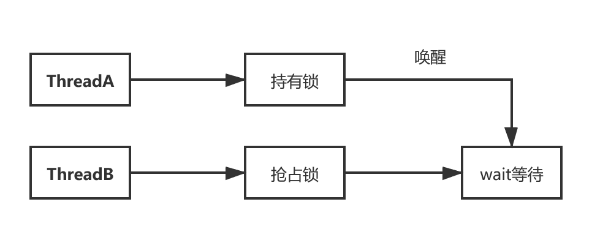


## 一个可见性问题引发的思考

```java
private static boolean stop = false;
public static void main(String[] args) {
    Thread thread = new Thread(() -> {
        int i = 0;
        while (!stop) {
            i++;
        }
    });
    thread.start();
    try {
        Thread.sleep(1000);
    } catch (InterruptedException e) {
        e.printStackTrace();
    }
    stop = true;
}
```

问题描述:

共享变量stop,主线程在子线程启动后修改stop,子线程无法感知stop变化,一直循环执行.这是可见性问题.

解决方案:

+ 共享变量stop使用volatile修饰

```java
private volatile static boolean stop = false;
```

使用[HSDIS工具]查看volatile汇编指令:

```assembly
  0x0000000004cc9052: lock add dword ptr [rsp],0h  ;*putfield constructorAccessor
```

为什么是lock指令,而不是其他内存屏障指令(Store,Load,Fence)?

这是因为不同的CPU和操作系统提供不一样的内存屏障指令.因此lock可以认为是统一接口指令,等价于内存屏障.

+ 子线程使用sleep/synchronized/print/文件(IO)操作

  > sleep Happens-Before原则

```java
private static boolean stop = false;
public static void main(String[] args) {
    Thread thread = new Thread(() -> {
        int i = 0;
        while (!stop) {
            i++;
            try {
                Thread.sleep(0);
            } catch (InterruptedException e) {
                e.printStackTrace();
            }
        }
    });
    thread.start();
    try {
        Thread.sleep(1000);
    } catch (InterruptedException e) {
        e.printStackTrace();
    }
    stop = true;
}
```

> print两个操作：IO阻塞，synchronized

```java
private static boolean stop = false;
public static void main(String[] args) {
    Thread thread = new Thread(() -> {
        int i = 0;
        while (!stop) {
            i++;
            System.out.println("可见性解决");
        }
    });
    thread.start();
    try {
        Thread.sleep(1000);
    } catch (InterruptedException e) {
        e.printStackTrace();
    }
    stop = true;
}
```

为什么print可以导致循环结束？

先来看看print的底层实现

```java
public void println() {
    newLine();
}    
private void newLine() {
    try {
        synchronized (this) {
            ensureOpen();
            textOut.newLine();
            textOut.flushBuffer();
            charOut.flushBuffer();
            if (autoFlush)
                out.flush();
        }
    }
    catch (InterruptedIOException x) {
        Thread.currentThread().interrupt();
    }
    catch (IOException x) {
        trouble = true;
    }
}
```

这里分为三个层面来解答：

- println底层用了synchronized同步关键字，这个同步会防止循环期间对于stop的缓存。
- println有加锁操作，而释放锁的操作，会强制性的把工作内存中涉及到的写操作同步到主内存。
- 从IO角度上看，print本质上是一个IO的操作。磁盘IO的效率一定要比CPU的计算效率慢得多，所以IO可以使得CPU有时间去做内存刷新的事情，从而导致这个现象。

IO阻塞

```java
private static boolean stop = false;
public static void main(String[] args) {
    Thread thread = new Thread(() -> {
        int i = 0;
        while (!stop) {
            i++;
            new File("E://a.txt");
        }
    });
    thread.start();
    try {
        Thread.sleep(1000);
    } catch (InterruptedException e) {
        e.printStackTrace();
    }
    stop = true;
}
```


## 使用volatile保证可见性

> 解决指令重排序问题,保证可见性

在单线程的环境下，如果向一个变量先写入一个值，然后在没有写干涉的情况下读取这个变量的值，那 这个时候读取到的这个变量的值应该是之前写入的那个值。这本来是一个很正常的事情。但是在多线程 环境下，读和写发生在不同的线程中的时候，可能会出现：读线程不能及时的读取到其他线程写入的最 新的值。这就是所谓的可见性

**volatile:通过内存屏障禁止指令重排序,通过汇编指令lock实现锁来保证可见性.**

Lock => 等价于内存平账

不同操作系统，不同CPU提供不同内存屏障指令，JVM提供统一接口处理，提供给JAVA高级指令volatile保证可见性。


## 从硬件层面分析可见性问题的本质

硬件：CPU，内存，IO设备

- CPU层面增加了高速缓存
- 操作系统，进程、线程|CPU时间片切换
- 编译器的优化，更合理的利用CPU缓存

> **CPU优化->新增高速缓存->出现缓存一致性问题->MESI协议解决缓存一致性问题->MESI通知失效会有阻塞->引入storebuffer实现异步通知失效->带来指令重排序问题->CPU提供内存屏障指令(Store,Load,Fence)**
>
> **最终需要从软件层面解决问题,比如volatile指令**

### CPU层面的高速缓存

> 缓存一致性问题

非统一内存访问架构

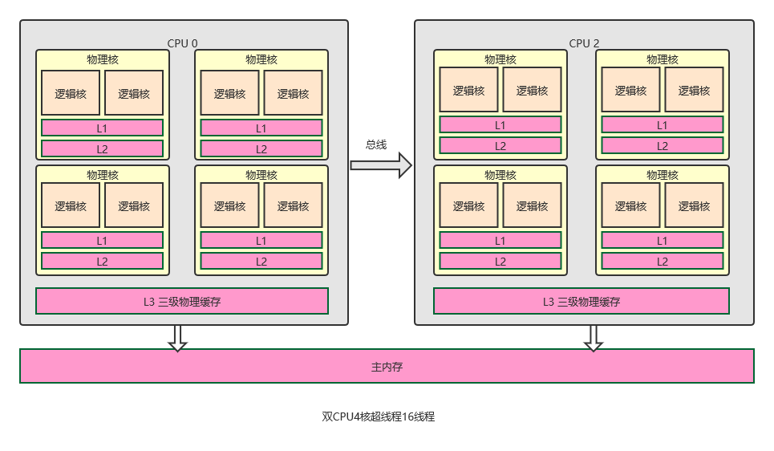

> ### 总线锁&缓存锁 
>
> 总线锁，简单来说就是，在多cpu下，当其中一个处理器要对共享内存进行操作的时候，在总线上发出 一个LOCK#信号，这个信号使得其他处理器无法通过总线来访问到共享内存中的数据，总线锁定把CPU 和内存之间的通信锁住了，这使得锁定期间，其他处理器不能操作其他内存地址的数据，所以总线锁定 的开销比较大，这种机制显然是不合适的 。 
>
> 如何优化呢？最好的方法就是控制锁的保护粒度，我们只需要保证对于被多个CPU缓存的同一份数据是 一致的就行。
>
> 在P6架构的CPU后，引入了缓存锁，如果当前数据已经被CPU缓存了，并且是要协会到主 内存中的，就可以采用缓存锁来解决问题。
> 所谓的缓存锁，就是指内存区域如果被缓存在处理器的缓存行中，并且在Lock期间被锁定，那么当它执 行锁操作回写到内存时，不再总线上加锁，而是修改内部的内存地址，基于缓存一致性协议来保证操作 的原子性。
> 总线锁和缓存锁怎么选择，取决于很多因素，比如CPU是否支持、以及存在无法缓存的数据时 （比较大或者快约多个缓存行的数据），必然还是会使用总线锁。 

## MESI优化带来的指令重排序问题

### 缓存一致性协议：MESI

> 带来问题：通知失效出现短暂阻塞

MSI  ，MESI 、MOSI ...
为了达到数据访问的一致，需要各个处理器在访问缓存时遵循一些协议，在读写时根据协议来操作，常 见的协议有MSI，MESI，MOSI等。

最常见的就是MESI协议，MESI表示缓存行的四种状态，分别是

1. M(Modify) 表示共享数据只缓存在当前CPU缓存中，并且是被修改状态，也就是缓存的数据和主内 存中的数据不一致
2. E(Exclusive) 表示缓存的独占状态，数据只缓存在当前CPU缓存中，并且没有被修改
3. S(Shared) 表示数据可能被多个CPU缓存，并且各个缓存中的数据和主内存数据一致
4. I(Invalid) 表示缓存已经失效

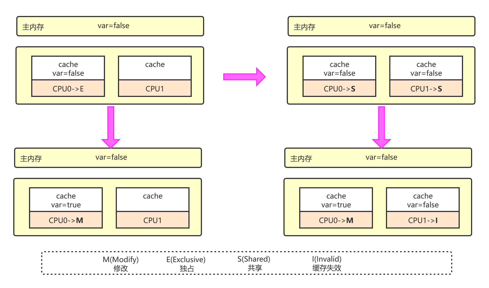

### MESI通知失效阻塞优化：引入StoreBuffers

> 每个CPU内核引入了Store Buffers（仅限于x64架构。x86架构是强一致性，无需Store Buffers）

> 带来问题：指令重排序

Store Bufferes是一个写的缓冲，对于上述描述的情况，CPU0可以先把写入的操作先存储到Store Bufferes中，Store Bufferes中的指令再按照缓存一致性协议去发起其他CPU缓存行的失效。而同步来 说CPU0可以不用等到Acknowledgement，继续往下执行其他指令，直到收到CPU0收到 Acknowledgement再更新到缓存，再从缓存同步到主内存.

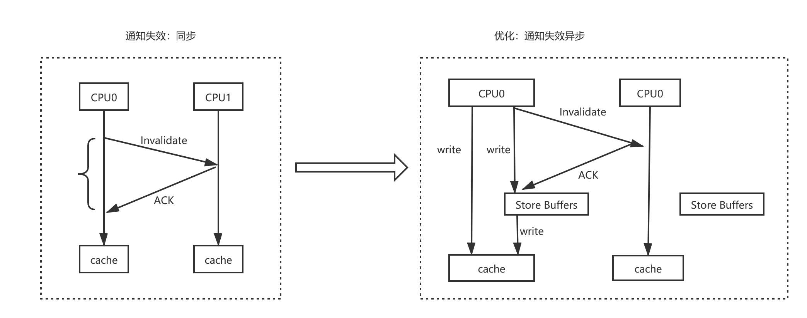


### 指令重排序

> 使用volatile解决指令重排序问题

由于硬件无法完全解决指令重排序问题,因此需要从软件层面去解决

我们来关注下面这段代码，假设分别有两个线程，分别执行executeToCPU0和executeToCPU1，分别由两个不同的CPU来执行。 

引入Store Bufferes之后，就可能出现 b==1返回true ，但是assert(a==1)返回false。

很多同学肯定会表 示不理解，这种情况怎么可能成立？那接下来我们去分析一下。

下面这段伪代码

```assembly
executeToCPU0(){
    a=1;
    b=1;
}
executeToCPU1(){
    while(b==1){
    	assert(a==1);
    }
}
```

在CPU层面重排序:

```java
executeToCPU0(){
    b=1;
    a=1;
}
executeToCPU1(){
    while(b==1){
    	assert(a==1);
    }
}
```

#### 通过内存屏障禁止了指令重排序

X86的memory barrier指令包括lfence(读屏障) sfence(写屏障) mfence(全屏障)

- Store Memory Barrier(写屏障)，告诉处理器在写屏障之前的所有已经存储在存储缓存(storebufferes)中的数据同步到主内存，简单来说就是使得写屏障之前的指令的结果对屏障之后的读或者写是可见的
- Load Memory Barrier(读屏障)，处理器在读屏障之后的读操作,都在读屏障之后执行。配合写屏障，使得写屏障之前的内存更新对于读屏障之后的读操作是可见的
- Full Memory Barrier(全屏障)，确保屏障前的内存读写操作的结果提交到内存之后，再执行屏障后的读写操作

```java
volatileinta=0;
executeToCpu0(){
    a=1;
    //storeMemoryBarrier()写屏障，写入到内存
    b=1;
}
executeToCpu1(){
    while(b==1){//true
        loadMemoryBarrier();//读屏障
        assert(a==1)//false
	}
}
```

#### JMM使用volatile禁止指令重排序

```java
volatile int a=0;
executeToCpu0(){
    a=1;
    storeload();
    b=1;
}
executeToCpu1(){
    while(b==1){
    	assert(a==1)//false
    }
}
```


## 从JMM层面了解可见性

简单来说，JMM定义了共享内存中多线程程序读写操作的行为规范：在虚拟机中把共享变量存储到内存以及从内存中取出共享变量的底层实现细节。通过这些规则来规范对内存的读写操作从而保证指令的正确性，它解决了CPU多级缓存、处理器优化、指令重排序导致的内存访问问题，保证了并发场景下的可见性。

> 需要注意的是，JMM并没有主动限制执行引擎使用处理器的寄存器和高速缓存来提升指令执行速度，也没主动限制编译器对于指令的重排序，也就是说在JMM这个模型之上，仍然会存在缓存一致性问题和指令重排序问题。JMM是一个抽象模型，它是建立在不同的操作系统和硬件层面之上对问题进行了统一的抽象，然后再Java层面提供了一些高级指令，让用户选择在合适的时候去引入这些高级指令来解决可见性问题。

其实通过前面的内容分析我们发现，导致可见性问题有两个因素，一个是高速缓存导致的可见性问题，另一个是指令重排序。

指令重排序,包括内存系统重排序,还有编译器优化重排序.


**那JMM是如何解决可见性和有序性问题的呢？**

其实前面在分析硬件层面的内容时，已经提到过了，对于缓存一致性问题，有总线锁和缓存锁，缓存锁是基于MESI协议。

而对于指令重排序，硬件层面提供了内存屏障指令。

而JMM在这个基础上提供了volatile、final等关键字，使得开发者可以在合适的时候增加相应相应的关键字来禁止高速缓存和禁止
指令重排序来解决可见性和有序性问题。

JMM提供4种屏障指令

| 屏障类型            | 指令示例                  | 说明                                                         |
| ------------------- | ------------------------- | ------------------------------------------------------------ |
| LoadLoad Barriers   | Load1;LoadLoad;Load2;     | 确保Load1数据的装载先于Load2及所有后续装载指令的装载         |
| StoreStore Barriers | Store1;StoreStore;Store2; | 确保Store1数据对其他处理器可见(刷新到内存)先于Store2及所有后续存储指令的存储 |
| LoadStore Barriers  | Load1;LoadStore;Store2;   | 确保Load1数据装载先于store2及所有后续的存储指令刷新到内存    |
| StoreLoad Barriers  | Store1;StoreLoad;Load2;   | 确保Store1数据对于其他处理器变得可见(刷新到内存)先于Load2及所有后续装载指令的装载.StoreLoad Barriers会使屏障之前的所有内存访问指令(存储和装载指令)完成之后,才执行该屏障之后的内存访问指令 |


## 从Java回归到volatile本质

Java内存模型提供了可见性和有序性问题的解决方案

volatile是如何解决可见性问题?

volatile是一种防止指令重排序的一种机制,通过内存屏障去解决可见性问题.


## Java内存模型

JMM是一个抽象的内存模型。

它定义了共享内存中多线程程序读写操作的行为规范：

在虚拟机中把共享变量存储到内存以及从内存中取出共享变量的底层实现细节。

通过这些规则来规范对内存的读写操作从而保证指令的正确性，它解决了CPU多级缓存、处理器优化、指令重排序导致的内存访问问题，保证了并发场景下的可见性。

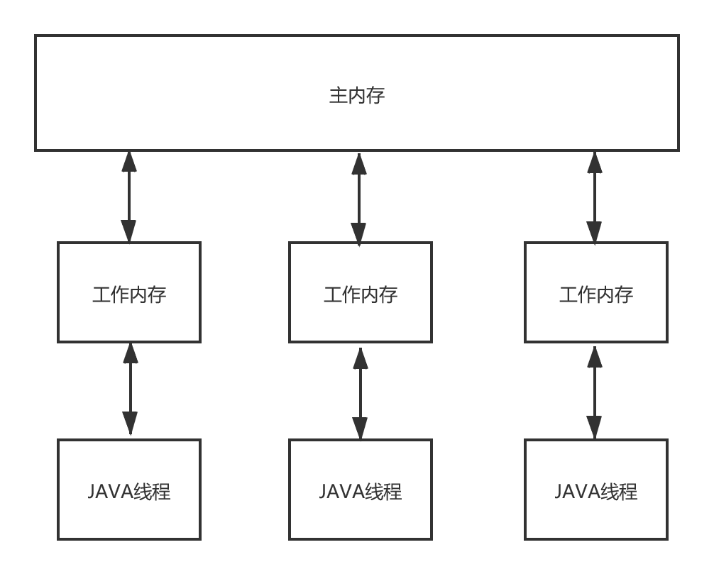

Java内存模型定义了8种操作来完成。这8种操作每一种都是原子操作。8种操作如下：

- lock(锁定)：作用于主内存，它把一个变量标记为一条线程独占状态；
- read(读取)：作用于主内存，它把变量值从主内存传送到线程的工作内存中，以便随后的load动作使用；    
-  load(载入)：作用于工作内存，它把read操作的值放入工作内存中的变量副本中；
-  use(使用)：作用于工作内存，它把工作内存中的值传递给执行引擎，每当虚拟机遇到一个需要使用这个变量的指令时候，将会执行这个动作；
-  assign(赋值)：作用于工作内存，它把从执行引擎获取的值赋值给工作内存中的变量，每当虚拟机遇到一个给变量赋值的指令时候，执行该操作；
-  store(存储)：作用于工作内存，它把工作内存中的一个变量传送给主内存中，以备随后的write操作使用；
-  write(写入)：作用于主内存，它把store传送值放到主内存中的变量中。
- unlock(解锁)：作用于主内存，它将一个处于锁定状态的变量释放出来，释放后的变量才能够被其他线程锁定；

Java内存模型还规定了执行上述8种基本操作时必须满足如下规则:

1、不允许read和load、store和write操作之一单独出现（即不允许一个变量从主存读取了但是工作内存不接受，或者从工作内存发起会写了但是主存不接受的情况），以上两个操作必须按顺序执行，但没有保证必须连续执行，也就是说，read与load之间、store与write之间是可插入其他指令的。
 2、不允许一个线程丢弃它的最近的assign操作，即变量在工作内存中改变了之后必须把该变化同步回主内存。
 3、不允许一个线程无原因地（没有发生过任何assign操作）把数据从线程的工作内存同步回主内存中。
 4、一个新的变量只能从主内存中“诞生”，不允许在工作内存中直接使用一个未被初始化（load或assign）的变量，换句话说就是对一个变量实施use和store操作之前，必须先执行过了assign和load操作。
 5、一个变量在同一个时刻只允许一条线程对其执行lock操作，但lock操作可以被同一个条线程重复执行多次，多次执行lock后，只有执行相同次数的unlock操作，变量才会被解锁。
 6、如果对一个变量执行lock操作，将会清空工作内存中此变量的值，在执行引擎使用这个变量前，需要重新执行load或assign操作初始化变量的值。
 7、如果一个变量实现没有被lock操作锁定，则不允许对它执行unlock操作，也不允许去unlock一个被其他线程锁定的变量。
 8、对一个变量执行unlock操作之前，必须先把此变量同步回主内存（执行store和write操作）。

参考：

《深入理解java虚拟机》

## Happens-Before可见性模型


除了显示引用volatile关键字能够保证可见性以外，在Java中，还有很多的可见性保障的规则。

从JDK1.5开始，引入了一个happens-before的概念来阐述多个线程操作共享变量的可见性问题。

所以我们可以认为在JMM中，如果一个操作执行的结果需要对另一个操作可见，那么这两个操作必须要存在happens-before关系。

这两个操作可以是同一个线程，也可以是不同的线程。

> 两个操作之间具有`happens-before关系`，并不意味着前一个操作必须要在后一个操作之前执行，happens-before仅仅要求前一个操作`(执行的结果)`对后一个操作可见，且前一个操作按顺序排在第二个操作之前。

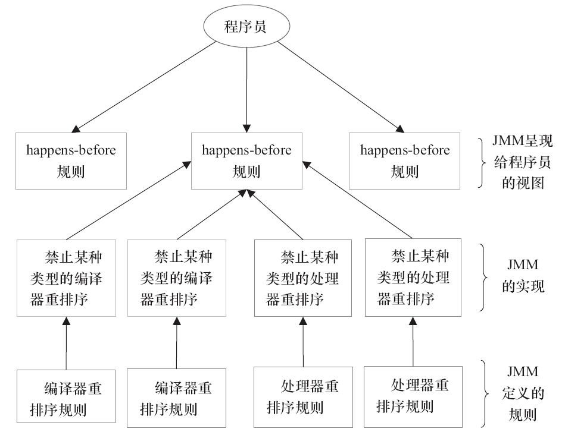

### 程序顺序规则（as-if-serial语义）

不能改变程序的执行结果(在单线程环境下，执行的结果不变.)
依赖问题，如果两个指令存在依赖关系，是不允许重排序.

```java
int a=0;
int b=0;
void test(){
    int a=1;
    int b=1;
    int c = a*b;
}
```

a happens -before b  ;  b happens before c

### 传递性规则

a happens-before b  , b happens- before c,   a happens-before c

### volatile变量规则

volatile修饰的变量的写操作，一定happens-before后续对于volatile变量的读操作.
内存屏障机制来防止指令重排.

图:volatile重排序规则表

| 是否能重排序 | 第二个操作 | 第二个操作 | 第二个操作 |
| ------------ | ---------- | ---------- | ---------- |
| 第一个操作   | 普通读/写  | volatile读 | volatile写 |
| 普通读/写    |            |            | NO         |
| volatile读   | NO         | NO         | NO         |
| volatile写   |            | NO         | NO         |

思考:下面这段代码i等于多少?

```java
public class VolatileExample{
    int a=0;
    volatile boolean flag=false;
    public void writer(){
        a=1;					//1
        flag=true;				//2
    }
    public void reader(){
        if(flag){//true			//3
        int i=a;//1				//4
    }
    public static void main(String[] args) {
        VolatileExample volatileDemo = new VolatileExample();
        volatileDemo.writer();
        volatileDemo.reader();
    }   
}
```

**按照volatile规则:**

- 第一个操作普通读/写,第二个操作volatile写,因此不能重排序.

1 happens-before 2是否成立？是

- 第一个操作volatile读,第二个操作普通读/写,因此不能重排序.

3 happens-before 4是否成立？是

- 第一个操作volatile写,第二个操作volcatile读,因此不能重排序.

2 happens -before 3是否成立？是

**因此,按照传递性规则**

1 happens-before 4 ; 是否成立？是

所以, i=1成立.

### synchronized监视器锁规则

```java
intx=10;
synchronized(this){
    //后续线程读取到的x的值一定12
    if(x<12){
        x=12;
    }
}
x=12;
```

### start规则

```java
public class StartDemo {
    
    static int x = 0 ;

    public static void main(String[] args) {

        Thread thread = new Thread(()->{
            // 读取x的值一定是12
            if(x == 12){
                System.out.println(x);
            }
        });
        x = 12;
        thread.start();
    }

}
```

### join规则

join可以保证线程执行顺序.

```java
public class JoinDemo {
    static int x = 0 ;
    public static void main(String[] args) {
        Thread t = new Thread(()->{
           x = 200;
        });
        t.start();
        try {
            // 阻塞,保证结果可见性 /在此处读取到的x的值一定是200.
            t.join();
        } catch (InterruptedException e) {
            e.printStackTrace();
        }
    }
}
```


源码:

```java
    public final void join() throws InterruptedException {
        join(0);
    }
```

```java
    public final synchronized void join(long millis)
    throws InterruptedException {
        long base = System.currentTimeMillis();
        long now = 0;

        if (millis < 0) {
            throw new IllegalArgumentException("timeout value is negative");
        }

        if (millis == 0) {
            while (isAlive()) {
                wait(0); // 本质上是使用wait方法阻塞
            }
        } else {
            while (isAlive()) {
                long delay = millis - now;
                if (delay <= 0) {
                    break;
                }
                wait(delay);
                now = System.currentTimeMillis() - base;
            }
        }
    }
```

结论:

> join 调用wait方法阻塞主线程
>
> join通过**synchronized**加锁,锁住的是子线程t的对象.
>
> 由于主线程阻塞,会将主线程放入子线程t对象的等待队列中,等待子线程t执行结束之后唤醒


```java
    private static void joinDemo() throws InterruptedException {
        Thread t1 = new Thread(()->{
            System.out.println(Thread.currentThread().getName()+"开始执行");
            try {
                Thread.sleep(3000);
            } catch (InterruptedException e) {
                e.printStackTrace();
            }
            System.out.println(Thread.currentThread().getName()+"开始结束");
        },"Join_Thread_1");
        t1.start();
        Thread t2 = new Thread(()->{
            System.out.println(Thread.currentThread().getName()+"开始执行");
            try {
                Thread.sleep(3000);
            } catch (InterruptedException e) {
                e.printStackTrace();
            }
            System.out.println(Thread.currentThread().getName()+"开始结束");
        },"Join_Thread_2");
        t2.start();
        Thread t3 = new Thread(()->{
            System.out.println(Thread.currentThread().getName()+"开始执行");
            try {
                Thread.sleep(3000);
            } catch (InterruptedException e) {
                e.printStackTrace();
            }
            System.out.println(Thread.currentThread().getName()+"开始结束");
        },"Join_Thread_3");
        t3.start();
        t1.join();
        System.out.println("全部执行完毕");
    }
```

无论用t1.t2.t3结果都一样,阻塞的都是主线程.

### sleep/yield/join区别

- sleep : 让线程睡眠指定时间,会释放CPU时间片,但是如果该线程持有对象锁,不会失去监视器的所有权,让其他非Synchronized的线程获得执行机会,阻塞中断会抛出InterruptedException
- yield : 同sleep相同的是让出时间片,同样不会释放锁标识,只是让线程回到可执行状态.不同的是,没有参数,不会抛出异常,只能让优先级等于或者小于的线程获得执行机会,因此有可能释放后立即又获得执行.
- join : 让线程的结果可见,阻塞中断会抛出InterruptedException.本质上是wait,notify.

```java
/**
     * Causes the currently executing thread to sleep (temporarily cease
     * execution) for the specified number of milliseconds, subject to
     * the precision and accuracy of system timers and schedulers. The thread
     * does not lose ownership of any monitors.
     *  意思是说：当前正在执行的线程休眠（暂时停止执行）指定的毫秒数，具体取决于系统计时器和调度程序的精度和准确性。 该线程不会失去任何监视器的所有权。
     * @param  millis
     *         the length of time to sleep in milliseconds  
     *         毫秒为单位
     * @throws  IllegalArgumentException
     *          if the value of {@code millis} is negative
     *
     * @throws  InterruptedException
     *          if any thread has interrupted the current thread. The
     *          <i>interrupted status</i> of the current thread is
     *          cleared when this exception is thrown.
     */
    public static native void sleep(long millis) throws InterruptedException;
```

其实主要的就是他是让其他线程走，自己进行休眠，但是自己却不会释放对象锁，也就是说，如果有同步锁的时候，其他线程不能访问共享数据。

注意该方法要捕获异常 比如有两个线程同时执行(没有Synchronized)，一个线程优先级为MAX_PRIORITY，另一  个为MIN_PRIORITY，如果没有Sleep()方法，只有高优先级的线程执行完成后，低优先级  的线程才能执行；但当高优先级的线程sleep(5000)后，低优先级就有机会执行了。  总之，sleep()可以使低优先级的线程得到执行的机会，当然也可以让同优先级、高优先级的 线程有执行的机会。


```java
/**
     * A hint to the scheduler that the current thread is willing to yield
     * its current use of a processor. The scheduler is free to ignore this
     * hint.
     *   意思是说 提示当前线程可以让处理器忽略当前线程，去处理其他线程
     * <p> Yield is a heuristic attempt to improve relative progression
     * between threads that would otherwise over-utilise a CPU. Its use
     * should be combined with detailed profiling and benchmarking to
     * ensure that it actually has the desired effect.
     * 它是一种启发式尝试，用于改善线程之间的相对进展，否则会过度利用CPU。 它的使用应与详细的分析和基准测试相结合，以确保它实际上具有所需的效果。
     * <p> It is rarely appropriate to use this method. It may be useful
     * for debugging or testing purposes, where it may help to reproduce
     * bugs due to race conditions. It may also be useful when designing
     * concurrency control constructs such as the ones in the
     * {@link java.util.concurrent.locks} package.   　 *  使用这种方法很少是合适的。 它可能对调试或测试目的很有用，它可能有助于重现因竞争条件而产生的错误。 在设计并发控制结构（如中的那些）时，它也可能很有用
     */
    public static native void yield();
```

yield() 这个方法从以上注释可以看出，也是一个休眠自身线程的方法，同样不会释放自身锁的标识，区别在于它是没有参数的，即yield()方 法只是使当前线程重新回到可执行状态，

所以执行yield()的线程有可能在进入到可执行状态 后马上又被执行，另外yield()方法只能使同优先级或者高优先级的线程得到执行机会，这也 和sleep()方法不同。

```java
/**
     * Waits for this thread to die.  
     *  等待线程死亡
     * <p> An invocation of this method behaves in exactly the same
     * way as the invocation
     *
     * <blockquote>
     * {@linkplain #join(long) join}{@code (0)}
     * </blockquote>
     *
     * @throws  InterruptedException
     *          if any thread has interrupted the current thread. The
     *          <i>interrupted status</i> of the current thread is
     *          cleared when this exception is thrown.
     */
    public final void join() throws InterruptedException {
        join(0);  // 调用了有参方法
    }
	/**
     * Waits at most {@code millis} milliseconds for this thread to
     * die. A timeout of {@code 0} means to wait forever.
     *  这个线程最多等多少毫秒，如果超时了，就会进行线程死锁
     * <p> This implementation uses a loop of {@code this.wait} calls
     * conditioned on {@code this.isAlive}. As a thread terminates the
     * {@code this.notifyAll} method is invoked. It is recommended that
     * applications not use {@code wait}, {@code notify}, or
     * {@code notifyAll} on {@code Thread} instances.
     *
     * @param  millis
     *         the time to wait in milliseconds
     *
     * @throws  IllegalArgumentException
     *          if the value of {@code millis} is negative
     *
     * @throws  InterruptedException
     *          if any thread has interrupted the current thread. The
     *          <i>interrupted status</i> of the current thread is
     *          cleared when this exception is thrown.
     */
       public final synchronized void join(long millis) throws InterruptedException {
        long base = System.currentTimeMillis();
        long now = 0;

        if (millis < 0) {
            throw new IllegalArgumentException("timeout value is negative");
        }

        if (millis == 0) {
            while (isAlive()) {
                wait(0);
            }
        } else {
            while (isAlive()) {
                long delay = millis - now;
                if (delay <= 0) {
                    break;
                }
                wait(delay);
                now = System.currentTimeMillis() - base;
            }
        }
    }
```

保证当前线程停止执行，直到该线程所加入的线程完成为止。然而，如果它加入的线程没有存活，则当前线程不需要停止。


## 死锁|活锁

死锁：一组互相竞争资源的线程因互相等待，导致“永久”阻塞的现象。
活锁：指的是任务或者执行者没有被阻塞，由于某些条件没有满足，导致一直重复尝试—失败—尝试—失败的过程。处于|r的实体是在不断的改变状态，活锁有可能自行解开

### 死锁发生的条件

这四个条件同时满足，就会产生死锁。

- 互斥，共享资源X和Y只能被一个线程占用；
- 占有且等待，线程T1已经取得共享资源X，在等待共享资源Y的时候，不释放共享资源X；
- 不可抢占，其他线程不能强行抢占线程T1占有的资源；
- 循环等待，线程T1等待线程T2占有的资源，线程T2等待线程T1占有的资源，就是循环等待。

### 如何解决死锁问题

> 互斥是锁的本质.

按照前面说的四个死锁的发生条件，我们只需要破坏其中一个，就可以避免死锁的产生。
其中，互斥这个条件我们没有办法破坏，因为我们用锁为的就是互斥，其他三个条件都有办法可以破坏
对于“占用且等待”这个条件，我们可以一次性申请所有的资源，这样就不存在等待了。
对于“不可抢占”这个条件，占用部分资源的线程进一步申请其他资源时，如果申请不到，可以主动释放它占有的资源，这样不可抢占这个条件就破坏掉了。
对于“循环等待”这个条件，可以靠按序申请资源来预防。所谓按序申请，是指资源是有线性顺序的，申请的时候可以先申请资源序号的，再申请资源序号大的，这样线性化后自然就不存在循环了。


## ThreadLocal

> 线程隔离机制。
> ThreadLocal实际上一种线程隔离机制，也是为了保证在多线程环境下对于共享变量的访问的安全性。

```java
public class ThreadLocalDemo {
    static ThreadLocal<Integer> local = new ThreadLocal<Integer>() {
        protected Integer initialValue() {
            return 0;//初始化一个值
        }
    };
    public static void main(String[]args){
        Thread[] thread = new Thread[5];
        for(int i=0;i<5;i++){
            thread[i] = new Thread(()->{
                int num = local.get();//获得的值都是0
                local.set(num+=5);//设置到local中
                System.out.println(Thread.currentThread().getName()+"-"+num);
            });
        }
        for(int i=0;i<5;i++){
            thread[i].start();
        }
    }
}
```


### 堆内存是共享的，为什么ThreadLocal能够控制指定线程访问呢？

- 调用ThreadLocal的`get`方法。

- 获取当前线程t1.

- 获取t1的成员变量`ThreadLocalMap`。

- 根据ThreadLocal的hashcode计算出ThreadLocalMap中Entry[]数组的索引。

- 返回索引位置的值

   因为这是这些值都直接保存在当前线程的成员变量ThreadLocalMap中，而ThreadLocal在这个过程中充当的角色则是提供它独一无二的hashcode值，这样我们就能计算出我们保存的值在ThreadLocalMap的位置。

  

### 问题1:脏数据

线程复用会产生脏数据。由于结程池会重用Thread对象，那么与Thread绑定的类的静态属性ThreadLocal变量也会被重用。如果在实现的线程run()方法体中不显式地调用remove() 清理与线程相关的ThreadLocal信息，那么倘若下一个结程不调用set() 设置初始值，就可能get() 到重用的线程信息，包括 ThreadLocal所关联的线程对象的value值。

### 问题2:内存泄漏

通常我们会使用使用static关键字来修饰ThreadLocal（这也是在源码注释中所推荐的）。在此场景下，其生命周期就不会随着线程结束而结束，寄希望于ThreadLocal对象失去引用后，触发弱引用机制来回收Entry的Value就不现实了。如果不进行remove() 操作，那么这个线程执行完成后，通过ThreadLocal对象持有的对象是不会被释放的。

> 以上两个问题的解决办法很简单，就是在每次用完ThreadLocal时， 必须要及时调用 remove()方法清理。

### 线性探测

> 线性探测，是用来解决hash冲突的一种策略。它是一种开放寻址策略，
> 我想大家应该都知道hash表，它是根据key进行直接访问的数据结构，也就是说我们可以通过
> hash函数把key映射到hash表中的一个位置来访问记录，从而加快查找的速度。存放记录的数据
> 就是hash表（散列表）
> 当我们针对一个key通过hash函数计算产生的一个位置，在hash表中已经被另外一个键值对占用
> 时，那么线性探测就可以解决这个冲突，这里分两种情况。
> 写入：查找hash表中离冲突单元最近的空闲单元，把新的键值插入到这个空闲单元
> 查找：根据hash函数计算的一个位置处开始往后查找，指导找到与key对应的value或者找到空的单元。


ThreadLocal原理分析


ThreadLocal和Thread的类关系图


### set 源码

- 初始化ThreadLocalMap数组,并使用斐波那契数列算法计算出数组下标位置,存放value


set实现:


```java
public void set(T value) {
    Thread t = Thread.currentThread();
    ThreadLocalMap map = getMap(t);		// 1
    if (map != null)
        map.set(this, value);			// 3
    else
        createMap(t, value);            // 2 
}
```

1 :: map = null

```java
ThreadLocal.ThreadLocalMap threadLocals = null;
ThreadLocalMap getMap(Thread t) {
    return t.threadLocals;			  // 这里返回null
}
```

2 :: 初始化t.threadLocals

```java

void createMap(Thread t, T firstValue) {
    t.threadLocals = new ThreadLocalMap(this, firstValue); // 2-1
}
```

2-1 ::  根据哈希码和数组长度求元素放置的位置，并设值

```java
private Entry[] table;
private static final int INITIAL_CAPACITY = 16;
ThreadLocalMap(ThreadLocal<?> firstKey, Object firstValue) {
    table = new Entry[INITIAL_CAPACITY];
    //根据哈希码和数组长度求元素放置的位置，即数组下标
    int i = firstKey.threadLocalHashCode & (INITIAL_CAPACITY - 1);
    table[i] = new Entry(firstKey, firstValue);
    size = 1;
    setThreshold(INITIAL_CAPACITY);
}
```

ThreadLocal->ThreadLocalMap->Entry关系:

```java
public class ThreadLocal<T> {    
	static class ThreadLocalMap {
        // Entry是一个以ThreadLocal为key，Object为value的键值对
        static class Entry extends WeakReference<ThreadLocal<?>> {
            Object value;
            Entry(ThreadLocal<?> k, Object v) {
                super(k);
                value = v;
            }
        }
    }
}
```

3 :: 已经存在值,是否需要解决hash冲突,是否需要扩容,是否需要清理脏数据

```java
private void set(ThreadLocal<?> key, Object value) {
    Entry[] tab = table;
    int len = tab.length;
    //根据哈希码和数组长度求元素放置的位置，即数组下标
    int i = key.threadLocalHashCode & (len-1);
    //从i开始往后一直遍历到数组最后一个Entry(线性探索)
    for (Entry e = tab[i];
         e != null;
         e = tab[i = nextIndex(i, len)]) {
        ThreadLocal<?> k = e.get();
		//如果key相等，覆盖value
        if (k == key) {
            e.value = value;
            return;
        }
        //如果key为null,用新key、value覆盖，同时清理历史key=null的陈旧数据(弱引用)
        if (k == null) {
            replaceStaleEntry(key, value, i);
            return;
        }
    }
    tab[i] = new Entry(key, value);
    //如果超过阀值，就需要扩容了
    int sz = ++size;
    if (!cleanSomeSlots(i, sz) && sz >= threshold)
        rehash();
}
```


> replaceStaleEntry :: 线性探测,解决hash冲突,替换脏数据

```java
private void replaceStaleEntry(ThreadLocal<?> key, Object value,int staleSlot) {
    Entry[] tab = table;
    int len = tab.length;
    Entry e;
    int slotToExpunge = staleSlot;
    // 从staleSlot位置向前探测,直到找到null的Entry元素,或者到tab[0],该位置标记为slotToExpunge
    for (int i = prevIndex(staleSlot, len);
         (e = tab[i]) != null;
         i = prevIndex(i, len))
        if (e.get() == null)
            slotToExpunge = i;
     // 从staleSlot位置向后探测,直到找到null的Entry元素,或者到tab[len-1]
    for (int i = nextIndex(staleSlot, len);
         (e = tab[i]) != null;
         i = nextIndex(i, len)) {
        ThreadLocal<?> k = e.get();
        if (k == key) {
            // 替换脏数据,解决hash冲突
            e.value = value;
            tab[i] = tab[staleSlot];
            tab[staleSlot] = e;
            if (slotToExpunge == staleSlot)
                slotToExpunge = i;
            // 清除key==null的数据
            cleanSomeSlots(expungeStaleEntry(slotToExpunge), len);
            return;
        }
        if (k == null && slotToExpunge == staleSlot)
            slotToExpunge = i;
    }
    tab[staleSlot].value = null;
    tab[staleSlot] = new Entry(key, value);
    if (slotToExpunge != staleSlot)
        cleanSomeSlots(expungeStaleEntry(slotToExpunge), len);
}
```

```java
private boolean cleanSomeSlots(int i, int n) {
    boolean removed = false;
    Entry[] tab = table;
    int len = tab.length;
    do {
        i = nextIndex(i, len);
        Entry e = tab[i];
        if (e != null && e.get() == null) {
            n = len;
            removed = true;
            i = expungeStaleEntry(i);
        }
    } while ( (n >>>= 1) != 0);
    return removed;
}
```

```java
private int expungeStaleEntry(int staleSlot) {
    Entry[] tab = table;
    int len = tab.length;
    // value有可能是强引用,因此设置为null,达到回收的目的
    tab[staleSlot].value = null;
    tab[staleSlot] = null;
    size--;
    Entry e;
    int i;
    for (i = nextIndex(staleSlot, len);
         (e = tab[i]) != null;
         i = nextIndex(i, len)) {
        ThreadLocal<?> k = e.get();
        if (k == null) {
            e.value = null;
            tab[i] = null;
            size--;
        } else {
            int h = k.threadLocalHashCode & (len - 1);
            if (h != i) {
                tab[i] = null;
                while (tab[h] != null)
                    h = nextIndex(h, len);
                tab[h] = e;
            }
        }
    }
    return i;
}
```


### get源码

```java
public T get() {
    Thread t = Thread.currentThread();
    ThreadLocalMap map = getMap(t);
    if (map != null) {
        ThreadLocalMap.Entry e = map.getEntry(this);
        if (e != null) {
            @SuppressWarnings("unchecked")
            T result = (T)e.value;
            return result;
        }
    }
    return setInitialValue();
}
```

```java
private Entry getEntry(ThreadLocal<?> key) {
    int i = key.threadLocalHashCode & (table.length - 1);
    Entry e = table[i];
    if (e != null && e.get() == key)
        return e;
    else
        return getEntryAfterMiss(key, i, e);
}
```


### 0x61c88647斐波那契数列

```java
private static final int HASH_INCREMENT=0x61c88647;
public static void main(String[]args){
    magicHash(16);
    magicHash(32);
}
private static void magicHash(int size){
    int hashCode=0;
    for(int i=0;i<size;i++){
        hashCode=i*HASH_INCREMENT+HASH_INCREMENT;
        System.out.print((hashCode&(size-1))+"");
    }
    System.out.println("");
}
```

打印结果: 会很均匀的散列

7,14,5,12,3,10,1,8,15,6,13,4,11,2,9,0
7,14,21,28,3,10,17,24,31,6,13,20,27,2,9,16,23,30,5,12,19,26,1,8,15,22,29,4,11,18,25,0


# 线程编程 : JUC

## Lock (Synchronized)

在Lock接口出现之前，Java中的应用程序对于多线程的并发安全处理只能基于synchronized关键字来解决。但是synchronized在有些场景中会存在一些短板，也就是它并不适合于所有的并发场景。但是在
Java5以后，Lock的出现可以解决synchronized在某些场景中的短板，它比synchronized更加灵活。


## 思考锁的实现（设计思维）

｛互斥｝
锁的互斥特性->共享资源（）->标记（0无锁，1代表有锁）
没有抢占到锁的线程？->释放CPU资源, [等待->唤醒]
等待的线程怎么存储？->数据结构去存储一些列等待中的线程，FIFO (等待队列)
公平和非公平（能否插队）
重入的特性（识别是否是同一个人？ThreadID）

{技术方案}
volatile state =0（无锁），1代表是持有锁，>1代表重入
wait/notify | condition需要唤醒指定线程。[LockSupport.park();   ->unpark(thread)]   unsafe
类中提供的一个方法
双向链表
逻辑层面去实现
在某一个地方存储当前获得锁的线程的ID，判断下次抢占锁的线程是否为同一个。


## 理解J.U.C中的ReentrantLock

```java
import java.util.concurrent.locks.*;
public class ReentrantLockApp {
    private static int count = 0;
    static Lock lock = new ReentrantLock();
    public static void inc(){
        lock.lock(); //获得锁(互斥锁),获得锁之后继续执行代码,没有获得锁的线程将会被阻塞
        try {
            Thread.sleep(1);
            count++;
            decr();  // 重入锁
        } catch (InterruptedException e) {
            e.printStackTrace();
        }finally {
            lock.unlock();//释放锁
        }
    }
    public static void decr(){
        lock.lock(); //获得锁(互斥锁)
        try {
            count--;
        }finally {
            lock.unlock();//释放锁
        }
    }
    public static void main(String[] args) {
        new Thread(()->{
            ReentrantLockApp.inc();
        },"Thread_A").start();

        new Thread(()->{
            ReentrantLockApp.inc();
        },"Thread_B").start();
        System.out.println(count);
    }
}
```

原理图


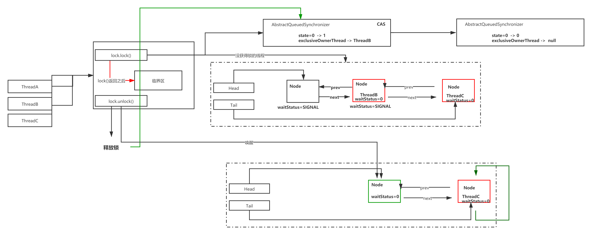

**Lock本质上通过LockSupport.park阻塞线程,并且通过LockSupport.unpark唤醒阻塞等待队列指定的线程**

> ReentrantLock

```java
// 默认非公平锁
private final Sync sync;
public ReentrantLock() {
    sync = new NonfairSync();
}
public ReentrantLock(boolean fair) {
    sync = fair ? new FairSync() : new NonfairSync();
}
public void lock() {
    sync.lock();
}
public void unlock() {
    sync.release(1);
}
protected final boolean tryRelease(int releases) {
    int c = getState() - releases;
    if (Thread.currentThread() != getExclusiveOwnerThread())
        throw new IllegalMonitorStateException();
    boolean free = false;
    if (c == 0) {
        free = true;
        setExclusiveOwnerThread(null);
    }
    setState(c);
    return free;
}
```

> Sync

```java
final boolean nonfairTryAcquire(int acquires) {
    final Thread current = Thread.currentThread();
    int c = getState();
    // 无锁状态,尝试抢占
    if (c == 0) {
        // 抢占锁成功,返回,可以继续执行代码
        if (compareAndSetState(0, acquires)) {
            setExclusiveOwnerThread(current);
            return true;
        }
    }
    // 重入锁
    else if (current == getExclusiveOwnerThread()) {
        int nextc = c + acquires;
        if (nextc < 0) // overflow
            throw new Error("Maximum lock count exceeded");
        // 由于独占,不存在可见性问题
        setState(nextc);
        return true;
    }
    return false;
}
```

> NonfairSync

```java
final void lock() {
    if (compareAndSetState(0, 1)) // 乐观锁尝试抢占锁 0标识无锁,抢到就修改锁标记为1
    	setExclusiveOwnerThread(Thread.currentThread());// 抢到锁之后,设置当前线程为独占线程
    else
    	acquire(1); // 没有抢到锁的线程,将会再次尝试抢占锁,抢到锁就继续代码;如果抢不到加入lock对象等待队列
}
protected final boolean tryAcquire(int acquires) {
    return nonfairTryAcquire(acquires);
}
```

> AbstractQueuedSynchronizer

```java
private static final long stateOffset; // 锁标记变量state在内存中相对位置,不存在可见性问题
 static {
        try {
            stateOffset = unsafe.
            	objectFieldOffset(AbstractQueuedSynchronizer.class.getDeclaredField("state"));
       } catch (Exception ex) { throw new Error(ex); }
 }
static final class Node {
    static final Node SHARED = new Node();
    static final Node EXCLUSIVE = null;    // 互斥线程节点
    static final int SIGNAL    = -1;
    // >0 标识线程被取消中断
    static final int CANCELLED =  1;
    // 阻塞等待队列,可以唤醒的线程状态
    static final int SIGNAL    = -1;
    // 条件队列
    static final int CONDITION = -2;
    static final int PROPAGATE = -3;
}
// 双向链表,头结点
private transient volatile Node head;
// 双向链表,尾结点
private transient volatile Node tail;
// 释放锁
public final boolean release(int arg) {
    if (tryRelease(arg)) {
        Node h = head;
        if (h != null && h.waitStatus != 0)
            // 唤醒
            unparkSuccessor(h);
        return true;
    }
    return false;
}
// 唤醒
private void unparkSuccessor(Node node) {
    int ws = node.waitStatus;
    if (ws < 0)
        compareAndSetWaitStatus(node, ws, 0);
    Node s = node.next;
    if (s == null || s.waitStatus > 0) {
        s = null;
        for (Node t = tail; t != null && t != node; t = t.prev)
            if (t.waitStatus <= 0)
                s = t;
    }
    if (s != null)
        LockSupport.unpark(s.thread);
}
// CAS尝试抢占锁
protected final boolean compareAndSetState(int expect, int update) {
	// 本地方法,CAS原子操作,锁标记state 0->1
	return unsafe.compareAndSwapInt(this, stateOffset, expect, update);
}
// 没有抢到锁的线程,将会再次尝试抢占锁,抢到锁就继续代码;如果抢不到加入lock对象等待队列
public final void acquire(int arg) {
    if (!tryAcquire(arg) &&				// tryAcquire会调用非公平锁的tryAcquire,这里arg==1
        acquireQueued(addWaiter(Node.EXCLUSIVE), arg)) // 抢占失败,加入等待队列.Node.EXCLUSIVE==null,arg==1
        selfInterrupt();
}
// 
private Node addWaiter(Node mode) {
    // Node.EXCLUSIVE==null,arg==1
    Node node = new Node(Thread.currentThread(), mode);
    // 等待队列是双向链表
    Node pred = tail;
    // 首次进入,这里为null
    if (pred != null) {
        node.prev = pred;
        if (compareAndSetTail(pred, node)) {
            pred.next = node;
            return node;
        }
    }
    // 构造等待队列双向列表: head -> new Node() -> node -> tail
    enq(node);
    return node;
}
// 构造等待队列双向列表: head -> new Node() -> node -> tail
private Node enq(final Node node) {
    for (;;) {
        Node t = tail;
        if (t == null) { // Must initialize
            if (compareAndSetHead(new Node())) // 1- 设置头结点 new Node()
                tail = head;			       // 2- 设置尾节点 new Node()
        } else {
            node.prev = t;					   // 3- 插入节点node的向前指针指向new Node()
            if (compareAndSetTail(t, node)) {  // 4- 设置尾节点tail指向插入节点node
                t.next = node;				   // 5- new Node()节点下一个节点指针指向node
                return t;					   // 6- 返回new Node()指针.
            }
        }
    }
}
// node是一个null的节点,下一个节点才是阻塞线程节点
final boolean acquireQueued(final Node node, int arg) {
    boolean failed = true;
    try {
        boolean interrupted = false;
        for (;;) {
            // 等待队列 head -> new Node() -> node -> tail ,这里的node就是new Node(),上一个节点就是head
            final Node p = node.predecessor(); 
            // 上一个节点是head,并且抢占锁成功
            if (p == head && tryAcquire(arg)) {
                // 将new Node()设置head节点,将下一个节点node设置尾null,返回false
                setHead(node);
                p.next = null; // help GC
                failed = false;
                return interrupted;
            }
            if (shouldParkAfterFailedAcquire(p, node) &&
                parkAndCheckInterrupt())
                interrupted = true;
        }
    } finally {
        if (failed)
            cancelAcquire(node);
    }
}
private void setHead(Node node) {
    head = node;
    node.thread = null;
    node.prev = null;
}
final Node predecessor() throws NullPointerException {
    Node p = prev;
    if (p == null)
        throw new NullPointerException();
    else
        return p;
}
// 线程挂起
private static boolean shouldParkAfterFailedAcquire(Node pred, Node node) {
     int ws = pred.waitStatus;
     if (ws == Node.SIGNAL)
         return true;
     if (ws > 0) {
         // 移除已经中断的线程节点
         do {
             node.prev = pred = pred.prev;
         } while (pred.waitStatus > 0);
         pred.next = node;
     } else {
         compareAndSetWaitStatus(pred, ws, Node.SIGNAL);
     }
     return false;
 }
```

> AbstractOwnableSynchronizer

```java
private transient Thread exclusiveOwnerThread;
protected final void setExclusiveOwnerThread(Thread thread) {
    exclusiveOwnerThread = thread;
}
```


## Condition :: 线程通信

wait/notify结合synchronized可以实现线程的通信。

Condition是一个多线程协调通信的工具类，可以让某些线程一起等待某个条件（condition），只有满足条件时，线程才会被唤醒 。

下面案例简单实现了 wait 和 notify 的功能,Condition是基于Lock。

```java
import java.util.concurrent.locks.*;
import java.util.concurrent.locks.Lock;
public class ConditionDemoWait implements Runnable{
    private Lock lock;
    private Condition condition ;
    public ConditionDemoWait(Lock lock, Condition condition) {
        this.lock = lock;
        this.condition = condition;
    }
    @Override
    public void run() {
        try {
            lock.lock();
            System.out.println("ConditionDemoWait lock :: "+Thread.currentThread().getName());
            Thread.sleep(1000);
            System.out.println("ConditionDemoWait wait :: "+Thread.currentThread().getName());
            condition.await();
        } catch (InterruptedException e) {
            e.printStackTrace();
        } finally {
            lock.unlock();
            System.out.println(Thread.currentThread().getName()+"-unlock");
        }
    }
}
```

```java
import java.util.concurrent.locks.*;
public class ConditionDemoSignal implements Runnable{
    private Lock lock;
    private Condition condition ;
    public ConditionDemoSignal(Lock lock, Condition condition) {
        this.lock = lock;
        this.condition = condition;
    }
    @Override
    public void run() {
        try {
            lock.lock();
            System.out.println("ConditionDemoSignal lock :: "+Thread.currentThread().getName());
            condition.signal();
            System.out.println("ConditionDemoSignal signal ::"+Thread.currentThread().getName());
        } finally {
            lock.unlock();
            System.out.println(Thread.currentThread().getName()+"-unlock");
        }
    }
}
```

```java
import java.util.concurrent.locks.*;
public class ConditionDemo {
    public static void main(String[] args) {
        Lock lock = new ReentrantLock();
        Condition condition = lock.newCondition();
        new Thread(new ConditionDemoWait(lock,condition),"Thread-A").start();
        new Thread(new ConditionDemoSignal(lock,condition),"Thread-B").start();
        new Thread(new ConditionDemoSignal(lock,condition),"Thread-C").start();
    }
}
```

执行结果：

```java
ConditionDemoWait lock :: Thread-A
ConditionDemoWait wait :: Thread-A
ConditionDemoSignal lock :: Thread-B
ConditionDemoSignal signal ::Thread-B
Thread-B-unlock
ConditionDemoSignal lock :: Thread-C
ConditionDemoSignal signal ::Thread-C
Thread-C-unlock
Thread-A-unlock
```

当调用 await方法后，当前线程会释放锁并等待，

而其他线程调用 condition 对象的 signal 或者 signalall 方法通知被阻塞的线程

然后自己执行unlock释放锁，被唤醒的线程获得之前的锁继续执行，最后释放锁。

 所以，condition 中两个最重要的方法，一个是 await，一 个是signal方法 :

- await:把当前线程阻塞挂起
- signal:唤醒阻塞的线程

**Condition 源码分析**

调用Condition，需要获得Lock锁，所以意味着会存在一 个AQS同步队列，在上面那个案例中，假如两个线程同时运行的话，那么AQS的队列可能是下面这种情况 

那么这个时候ThreadA调用了condition.await方法，它做 了什么事情呢？ 
**condition.await** 

> AbstractQueuedSynchronizer

```java
/** waitStatus value to indicate thread has cancelled */
static final int CANCELLED =  1;
/** waitStatus value to indicate successor's thread needs unparking */
static final int SIGNAL    = -1;
/** waitStatus value to indicate thread is waiting on condition */
static final int CONDITION = -2;
/**
 * waitStatus value to indicate the next acquireShared should
 * unconditionally propagate
 */
static final int PROPAGATE = -3;
public final void await() throws InterruptedException {
    if (Thread.interrupted())	// 表示 await 允许被中断
        throw new InterruptedException();
    Node node = addConditionWaiter();	//创建一个新的节点，节点状态为 condition，采用的数据结构仍然是链表
    int savedState = fullyRelease(node);//释放当前的锁，得到锁的状态，并唤醒 AQS 队列中的一个线程
    int interruptMode = 0;
    //如果当前节点没有在同步队列上，即还没有被 signal，则将当前线程阻塞 
    while (!isOnSyncQueue(node)) { //判断这个节点是否在 AQS 队列上，第一次判断的是 false，因为前面已经释放锁了 
        LockSupport.park(this);    // 通过 park 挂起当前线程
        // 重要:这里是阻塞位置.唤醒也从这里开始
        if ((interruptMode = checkInterruptWhileWaiting(node)) != 0)
            break;
    }
    // 当这个线程醒来,会尝试拿锁, 当 acquireQueued 返回 false 就是拿到锁了. 
    // interruptMode != THROW_IE -> 表示这个线程没有成功将 node 入队,但 signal 执行了 enq 方法让其入队了. 
	// 将这个变量设置成 REINTERRUPT.
    if (acquireQueued(node, savedState) && interruptMode != THROW_IE)
        interruptMode = REINTERRUPT;
    // 如果 node 的下一个等待者不是 null, 则进行清理,清理 Condition 队列上的节点.  
	// 如果是 null ,就没有什么好清理的了. 
    if (node.nextWaiter != null) // clean up if cancelled
        unlinkCancelledWaiters();
    // 如果线程被中断了,需要抛出异常.或者什么都不做 
    if (interruptMode != 0)
        reportInterruptAfterWait(interruptMode);
}
final int fullyRelease(Node node) {
    boolean failed = true;
    try {
        int savedState = getState();
        if (release(savedState)) {
            failed = false;
            return savedState;
        } else {
            throw new IllegalMonitorStateException();
        }
    } finally {
        if (failed)
            node.waitStatus = Node.CANCELLED;
    }
}
public final boolean release(int arg) {
    // 重入锁全部释放
    if (tryRelease(arg)) {
        Node h = head;
        if (h != null && h.waitStatus != 0)
            unparkSuccessor(h);
        return true;
    }
    return false;
}
protected final int getState() {
    return state;
}

```

> ConditionObject

```java
//会产生condition队列
private transient Node firstWaiter;
private transient Node lastWaiter;
private Node addConditionWaiter() {
     Node t = lastWaiter;
     // If lastWaiter is cancelled, clean out.
     // 如果lastWaiter不 等 于 空 并 且waitStatus不等于CONDITION时，把冲好这个节点从链表中移除
     if (t != null && t.waitStatus != Node.CONDITION) {
         unlinkCancelledWaiters();
         t = lastWaiter;
     }
    //构建一个Node，waitStatus=CONDITION。 这里的链表是一个单向的，所以相比 AQS 来说会 简单很多
     Node node = new Node(Thread.currentThread(), Node.CONDITION);
     if (t == null)
         firstWaiter = node;
     else
         t.nextWaiter = node;
     lastWaiter = node;
     return node;
 }
// 将等待队列(Condition)的第一个线程删除,并唤醒第一个线程
public final void signal() {
    if (!isHeldExclusively())
        throw new IllegalMonitorStateException();
    Node first = firstWaiter;
    if (first != null)
        doSignal(first);
}
private void doSignal(Node first) {
    do {
        if ( (firstWaiter = first.nextWaiter) == null)
            lastWaiter = null;
        first.nextWaiter = null;
    } while (!transferForSignal(first) &&
             (first = firstWaiter) != null);
}
final boolean transferForSignal(Node node) {
    if (!compareAndSetWaitStatus(node, Node.CONDITION, 0))
        return false;
    Node p = enq(node);// 加入到同步队列
    int ws = p.waitStatus;
    if (ws > 0 || !compareAndSetWaitStatus(p, ws, Node.SIGNAL))
        LockSupport.unpark(node.thread);
    return true;
}
```

> ReentrantLock

```java
// 重入锁全部释放,则返回true
protected final boolean tryRelease(int releases) {
    int c = getState() - releases;
    if (Thread.currentThread() != getExclusiveOwnerThread())
        throw new IllegalMonitorStateException();
    boolean free = false;
    if (c == 0) {
        free = true;
        setExclusiveOwnerThread(null);
    }
    setState(c);
    return free;
}
```


**await和signal的总结**

我把前面的整个分解的图再通过一张整体的结构图来表述，


线程awaitThread先通过lock.lock()方法获取锁成功后调用了condition.await方法进入等待队列，

而另一个线程signalThread通过lock.lock()方法[从上一次阻塞的位置继续执行]获取锁成功后调用了condition.signal或者signalAll方法，使得线程awaitThread能够有机会移入到同步队列中，

当其他线程释放lock后使得线程awaitThread能够有机会获取lock，从而使得线程awaitThread能够从await方法中退出执行后续操作。

如果awaitThread获取lock失败会直接进入到同步队列。

 阻塞的位置说明:

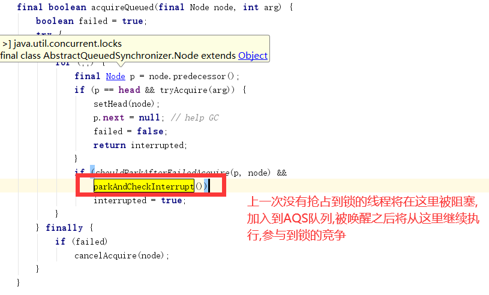


阻塞：await()方法中，在线程释放锁资源之后，如果节点不在AQS等待队列，则阻塞当前线程，如果在等待队列，则自旋等待尝试获取锁
释放：signal()后，节点会从condition队列移动到AQS等待队列，则进入正常锁的获取流程

## CountDownLatch::同步工具类

countdownlatch是一个同步工具类，它允许一个或多个线程一直等待，直到其他线程的操作执行完毕再执行。

从命名可以解读到countdown是倒数的意思，类似于我们倒计时的概念。

countdownlatch提供了两个方法，一个是countDown，一个是await.

从代码的实现来看，有点类似join的功能，但是比join更加灵活。

CountDownLatch构造函数会接收一个int类型的参数作为计数器的初始值，当调用CountDownLatch的countDown方法时，这个计数器就会减一,在这个整数倒数到0之前，调用了await方法之前,程序都必须要等待。

通过await方法去阻塞去阻塞主流程

> **最后一个countdown 执行后，await就可以过了**

```java
    public static void main(String[] args) throws InterruptedException {
        CountDownLatch countDownLatch = new CountDownLatch(3);
        new Thread(()->{
            System.out.println(Thread.currentThread().getName()+"开始执行");
            for(int i = 0 ; i< 1000000000;i++){
                int k = i * 100;
            }
            System.out.println(Thread.currentThread().getName()+"开始结束");
            countDownLatch.countDown();
        },"Thread_1").start();
        new Thread(()->{
            System.out.println(Thread.currentThread().getName()+"开始执行");
            for(int i = 0 ; i< 1000000000;i++){
                int k = i * 100;
            }
            System.out.println(Thread.currentThread().getName()+"开始结束");
            countDownLatch.countDown();
        },"Thread_2").start();
        new Thread(()->{
            System.out.println(Thread.currentThread().getName()+"开始执行");
            for(int i = 0 ; i< 1000000000;i++){
                int k = i * 100;
            }
            System.out.println(Thread.currentThread().getName()+"开始结束");
            countDownLatch.countDown();// 最后一个countDown执行之后,就可以继续执行
        },"Thread_3").start();
        countDownLatch.await();
        new Thread(()->{
            System.out.println(Thread.currentThread().getName()+"开始执行");
            for(int i = 0 ; i< 1000000000;i++){
                int k = i * 100;
            }
            System.out.println(Thread.currentThread().getName()+"开始结束");
            countDownLatch.countDown();// 最后一个countDown执行之后,就可以继续执行
        },"Thread_4").start();
        System.out.println("全部执行完毕");
    }
```

执行结果:

```
Thread_1开始执行
Thread_2开始执行
Thread_3开始执行
Thread_3开始结束
Thread_1开始结束
Thread_2开始结束
全部执行完毕
Thread_4开始执行
Thread_4开始结束
```

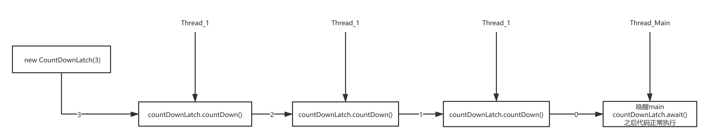

### 业务场景使用:模拟高并发场景

总的来说，凡事涉及到需要指定某个人物在执行之前，要等到前置人物执行完毕之后才执行的场景，都可以使用CountDownLatch

```java
public class CountDownLatchApp implements Runnable{

    static CountDownLatch countDownLatch = new CountDownLatch(1);

    public static void main(String[] args) throws InterruptedException {
        // 模仿高并发场景
        for (int i = 0 ; i < 100 ; i++){
            new Thread(new CountDownLatchApp(),"Thread_"+i).start();
        }
        countDownLatch.countDown();
    }
    @Override
    public void run() {
        try {
            countDownLatch.await();
            System.out.println(Thread.currentThread().getName());
        } catch (InterruptedException e) {
            e.printStackTrace();
        }
    }
}
```

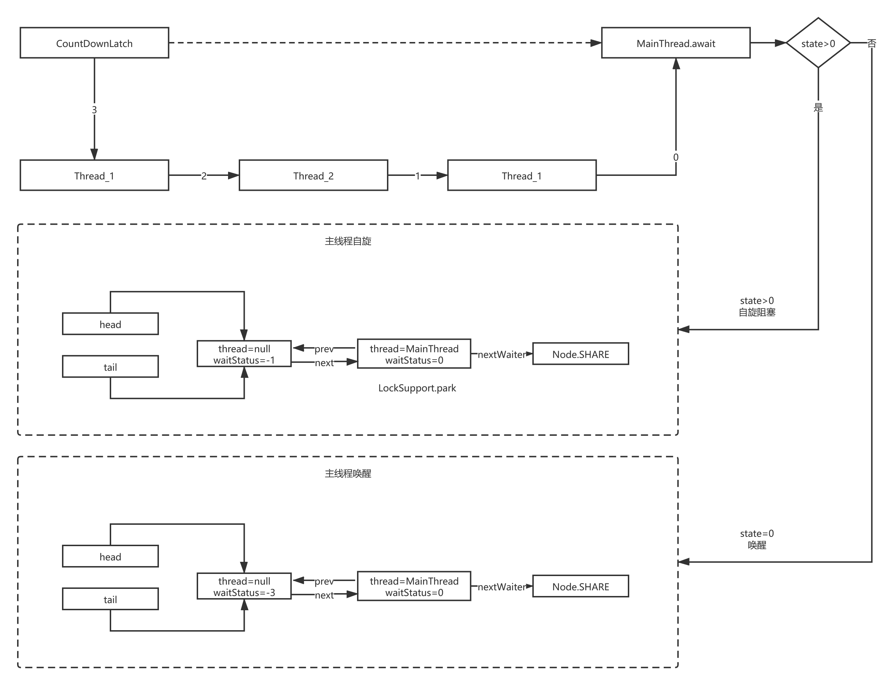

### CountDownLatch源码分析

对于CountDownLatch，我们仅仅需要关心两个方法，一个是countDown()方法，另一个是await()方法。countDown()方法每次调用都会将state减1，直到state的值为0；而await是一个阻塞方法，当state减为0的时候，await方法才会返回。await可以被多个线程调用，大家在这个时候脑子里要有个图：所有调用了await方法的线程阻塞在AQS的阻塞队列中，等待条件满足（state == 0），将线程从队列中一个个唤醒过来。

- new CountDownLatch(int count)

> CountDownLatch

```java
// countdownlatch也用到了AQS，在CountDownLatch内部写了一个Sync并且继承了AQS这个抽象类重写了AQS中的共享锁方法。
private static final class Sync extends AbstractQueuedSynchronizer {
    private static final long serialVersionUID = 4982264981922014374L;

    Sync(int count) {
        setState(count); // AQS The synchronization state. 
    }
//...

}
private final Sync sync;
public CountDownLatch(int count) {
    if (count < 0) throw new IllegalArgumentException("count < 0");
    this.sync = new Sync(count);
}
```

> AbstractQueuedSynchronizer

```java
protected final void setState(int newState) {
    state = newState;
}
```

- await

> CountDownLatch

```java
public void await() throws InterruptedException {
    sync.acquireSharedInterruptibly(1);
}
```

> AbstractQueuedSynchronizer

```java
 public final void acquireSharedInterruptibly(int arg)
     throws InterruptedException {
     if (Thread.interrupted())
         throw new InterruptedException();
     if (tryAcquireShared(arg) < 0)  // state>0时
         doAcquireSharedInterruptibly(arg);
 }
```

1. tryAcquireShared(1) < 0

   > CountDownLatch.Sync

```java
protected int tryAcquireShared(int acquires) {
    return (getState() == 0) ? 1 : -1;
}
```

2. doAcquireSharedInterruptibly(1)

> AbstractQueuedSynchronizer

```java
private void doAcquireSharedInterruptibly(int arg)
    throws InterruptedException {
    // 1- 共享锁 node主线程节点
    final Node node = addWaiter(Node.SHARED);
    boolean failed = true;
    try {
        for (;;) {
  	// 2- 自旋第一次:主线程的prev节点
            final Node p = node.predecessor();
  	// 3- 头节点
            if (p == head) {
  	// 4- state>0时,r<0; state==0时,r==0
                int r = tryAcquireShared(arg);
                if (r >= 0) {
    // 
                    setHeadAndPropagate(node, r);
                    p.next = null; // help GC
                    failed = false;
                    return;
                }
            }
   // 如果子线程start没有立马-1,那么将会走这里
   // 5 自旋第一次:设置主线程节点的上一个节点pred waitStatus=-1,返回false
   // 5 自旋第二次:主线程节点的上一个节点pred waitStatus=-1,返回true
            if (shouldParkAfterFailedAcquire(p, node) &&
    //6- 挂起线程,主线程将会在自旋第二次的时候最在这个位置
                parkAndCheckInterrupt())
                throw new InterruptedException();
        }
    } finally {
        if (failed)
            cancelAcquire(node);
    }
}
// 1-共享锁
private Node addWaiter(Node mode) {
    // 1.1 主线程节点
    Node node = new Node(Thread.currentThread(), mode);
    // Try the fast path of enq; backup to full enq on failure
    Node pred = tail;
    if (pred != null) {
        node.prev = pred;
        if (compareAndSetTail(pred, node)) {
            pred.next = node;
            return node;
        }
    }
    // 1.2 加入同步队列
    enq(node);
    return node;
}
// 1.2 构建AQS双向链表同步队列,node为主线程节点加入同步队列 
private Node enq(final Node node) {
    for (;;) {
        Node t = tail;
        if (t == null) { // Must initialize
            if (compareAndSetHead(new Node()))
                tail = head;
        } else {
            node.prev = t;
            if (compareAndSetTail(t, node)) {
                t.next = node;
                return t;
            }
        }
    }
}
// 2- 主线程的prev节点,也就是头节点
 final Node predecessor() throws NullPointerException {
     Node p = prev;
     if (p == null)
         throw new NullPointerException();
     else
         return p;
 }
// 5 设置主线程节点的上一个节点pred waitStatus=-1 上一个节点,node 主线程节点
private static boolean shouldParkAfterFailedAcquire(Node pred, Node node) {
    int ws = pred.waitStatus;
    if (ws == Node.SIGNAL)
        /*
             * This node has already set status asking a release
             * to signal it, so it can safely park.
             */
        return true;
    if (ws > 0) {
        /*
             * Predecessor was cancelled. Skip over predecessors and
             * indicate retry.
             */
        do {
            node.prev = pred = pred.prev;
        } while (pred.waitStatus > 0);
        pred.next = node;
    } else {
        /*
             * waitStatus must be 0 or PROPAGATE.  Indicate that we
             * need a signal, but don't park yet.  Caller will need to
             * retry to make sure it cannot acquire before parking.
             */
        compareAndSetWaitStatus(pred, ws, Node.SIGNAL);
    }
    return false;
}
// 6- 挂起线程
private final boolean parkAndCheckInterrupt() {
    LockSupport.park(this);
    return Thread.interrupted();
}
```


- countDown

> CountDownLatch

```java
public void countDown() {
	sync.releaseShared(1);
}
```

> AbstractQueuedSynchronizer

```java
public final boolean releaseShared(int arg) {
    if (tryReleaseShared(arg)) { // 当state==0时,释放共享锁,每次-1
        doReleaseShared();		 // 释放共享锁
        return true;
    }
    return false;
}
```

**tryReleaseShared(arg)**

> CountDownLatch.Sync

```java
protected boolean tryReleaseShared(int releases) {
    // Decrement count; signal when transition to zero
    for (;;) {
        int c = getState();
        if (c == 0)
            return false;
        int nextc = c-1;
        if (compareAndSetState(c, nextc))
            return nextc == 0;
    }
}
```

**doReleaseShared()**

> AbstractQueuedSynchronizer

标识为PROPAGATE状态的节点,上共享锁模式下的节点状态,处于这个状态下的节点,会对线程的唤醒进行传播.

```java
    private void doReleaseShared() {
        for (;;) {
            Node h = head;
            if (h != null && h != tail) {
                int ws = h.waitStatus;
                if (ws == Node.SIGNAL) {
                    if (!compareAndSetWaitStatus(h, Node.SIGNAL, 0))
                        continue;            // loop to recheck cases
                    // 1-头节点,唤醒主线程
                    unparkSuccessor(h);
                }
                else if (ws == 0 &&
                         !compareAndSetWaitStatus(h, 0, Node.PROPAGATE))
                    continue;                // loop on failed CAS
            }
            if (h == head)                   // loop if head changed
                break;
        }
    }
```

唤醒主线程::

```java
    private void unparkSuccessor(Node node) {
        /*
         * If status is negative (i.e., possibly needing signal) try
         * to clear in anticipation of signalling.  It is OK if this
         * fails or if status is changed by waiting thread.
         */
        int ws = node.waitStatus;
        if (ws < 0)
            compareAndSetWaitStatus(node, ws, 0);

        /*
         * Thread to unpark is held in successor, which is normally
         * just the next node.  But if cancelled or apparently null,
         * traverse backwards from tail to find the actual
         * non-cancelled successor.
         */
        Node s = node.next;
        if (s == null || s.waitStatus > 0) {
            s = null;
            for (Node t = tail; t != null && t != node; t = t.prev)
                if (t.waitStatus <= 0)
                    s = t;
        }
        if (s != null)
            LockSupport.unpark(s.thread);
    }
```

## Semaphore::限流

emaphore也就是我们常说的信号灯，semaphore可以控制同时访问的线程个数，通过acquire获取一个许可，如果没有就等待，通过release释放一个许可。有点类似限流的作用。叫信号灯的原因也和他的用处有关，比如某商场就5个停车位，每个停车位只能停一辆车，如果这个时候来了10辆车，必须要等前面有空的车位才能进入。

使用案例

```java
public class SemaphoreApp implements Runnable {
    private Semaphore semaphore;
    public SemaphoreApp(Semaphore semaphore) {
        this.semaphore = semaphore;
    }
    public static void main(String[] args) {
        Semaphore semaphore = new Semaphore(5);
        for(int i = 0 ;i < 10 ; i ++){
            new Thread(new Thread(new SemaphoreApp(semaphore)),"Thread_"+i).start();
        }
    }
    @Override
    public void run() {
        try {
            semaphore.acquire(1);
            System.out.println("begin "+Thread.currentThread().getName());
            Thread.sleep(2000);
            System.out.println("end "+Thread.currentThread().getName());
            semaphore.release();
        } catch (InterruptedException e) {
            e.printStackTrace();
        }
    }
}
```

执行结果

```java
begin Thread_0
begin Thread_4
begin Thread_1
begin Thread_2
begin Thread_3
end Thread_2
end Thread_1
end Thread_0
begin Thread_6
end Thread_4
end Thread_3
begin Thread_9
begin Thread_7
begin Thread_5
begin Thread_8
end Thread_5
end Thread_8
end Thread_7
end Thread_9
end Thread_6
```

### Semaphore源码分析

- new Semaphore(5)

  Semaphore与CountDownLatch区别:Semaphore分公平策略和非公平策略

> Semaphore

```java
 public Semaphore(int permits) {
     sync = new NonfairSync(permits);// AQS state=5
 }
static final class NonfairSync extends Sync {
    private static final long serialVersionUID = -2694183684443567898L;

    NonfairSync(int permits) {
        super(permits);
    }

    protected int tryAcquireShared(int acquires) {
        return nonfairTryAcquireShared(acquires);
    }
}
static final class FairSync extends Sync {
    private static final long serialVersionUID = 2014338818796000944L;

    FairSync(int permits) {
        super(permits);
    }

    protected int tryAcquireShared(int acquires) {
        for (;;) {
            if (hasQueuedPredecessors())
                return -1;
            int available = getState();
            int remaining = available - acquires;
            if (remaining < 0 ||
                compareAndSetState(available, remaining))
                return remaining;
        }
    }
}
abstract static class Sync extends AbstractQueuedSynchronizer {
    private static final long serialVersionUID = 1192457210091910933L;

    Sync(int permits) {
        setState(permits);
    }
}
```

- acquire

  这里源码同CountDownLatch.await

> Semaphore

```java
public void acquire() throws InterruptedException {
    // 本质上调用sync的tryAcquireShared方法,但是sync这里有公平锁和非公平锁
    sync.acquireSharedInterruptibly(1);
}
```

> AbstractQueuedSynchronizer

```java
public final void acquireSharedInterruptibly(int arg)
    throws InterruptedException {
    if (Thread.interrupted())
        throw new InterruptedException();
    if (tryAcquireShared(arg) < 0)
        doAcquireSharedInterruptibly(arg);
}
private void doAcquireSharedInterruptibly(int arg)
    throws InterruptedException {
    final Node node = addWaiter(Node.SHARED);
    boolean failed = true;
    try {
        for (;;) {
            final Node p = node.predecessor();
            if (p == head) {
                int r = tryAcquireShared(arg);
                if (r >= 0) {
                    setHeadAndPropagate(node, r);
                    p.next = null; // help GC
                    failed = false;
                    return;
                }
            }
            if (shouldParkAfterFailedAcquire(p, node) &&
                parkAndCheckInterrupt())
                throw new InterruptedException();
        }
    } finally {
        if (failed)
            cancelAcquire(node);
    }
}
```

- release

  这里源码同CountDownLatch.countDown

> Semaphore

```java
public void release() {
    sync.releaseShared(1);
}
```

> AbstractQueuedSynchronizer

```java
public final boolean releaseShared(int arg) {
    if (tryReleaseShared(arg)) {
        doReleaseShared();
        return true;
    }
    return false;
}
```

### Semaphore与CountDownLatch区别

Semaphore分公平策略和非公平策略

通过对比发现公平和非公平的区别就在于是否多了一个hasQueuedPredecessors的判断

```java
static final class NonfairSync extends Sync {
    protected int tryAcquireShared(int acquires) {
        return nonfairTryAcquireShared(acquires);
    }
}
static final class FairSync extends Sync {
    protected int tryAcquireShared(int acquires) {
        for (;;) {
            // 区别就在于是不是会先判断是否有线程在排队，然后才进行CAS减操作
            if (hasQueuedPredecessors())
                return -1;
            int available = getState();
            int remaining = available - acquires;
            if (remaining < 0 ||
                compareAndSetState(available, remaining))
                return remaining;
        }
    }
}
```

> AbstractQueuedSynchronizer

```java
public final boolean hasQueuedPredecessors() {
    Node t = tail; // Read fields in reverse initialization order
    Node h = head;
    Node s;
    return h != t &&
        ((s = h.next) == null || s.thread != Thread.currentThread());
}
```

## CyclicBarrier

CyclicBarrier的字面意思是可循环使用（Cyclic）的屏障（Barrier）。

它要做的事情是，让一组线程到达一个屏障（也可以叫同步点）时被阻塞，直到最后一个线程到达屏障时，屏障才会开门，所有被屏障拦截的线程才会继续工作。

CyclicBarrier默认的构造方法是CyclicBarrier(int parties)，其参数表示屏障拦截的线程数量，每个线程调用await方法告诉CyclicBarrier当前线程已经到达了屏障，然后当前线程被阻塞.

**使用场景**

当存在需要所有的子任务都完成时，才执行主任务，这个时候就可以选择使用CyclicBarrier.

**使用案例**

模拟多个线程取数,最后合并解析数据的例子

```java
public class DataImportThread extends Thread {

    private CyclicBarrier cyclicBarrier;
    private String path;

    public DataImportThread(CyclicBarrier cyclicBarrier, String path) {
        this.cyclicBarrier = cyclicBarrier;
        this.path = path;
    }

    @Override
    public void run() {
        System.out.println("开始导入： "+path+"位置的数据");
        try{
            for(int i = 0 ; i < 10000000;i ++){

            }
            cyclicBarrier.await();
         }catch(InterruptedException e) {
            e.printStackTrace();
        }catch(BrokenBarrierException e) {
            e.printStackTrace();
        }
    }
}
```

```java
public class CyclicBarrierDemo extends Thread {

    @Override
    public void run() {
        System.out.println("开始进行数据分析");
    }

    public static void main(String[] args) {
        CyclicBarrier cyclicBarrier = new CyclicBarrier(3, new CyclicBarrierDemo())
        // Thread_1 调用await方法,获得lock
        // Thread_2和Thread_3将在竞争lock时阻塞加入AQS队列
        // 
        new Thread(new DataImportThread(cyclicBarrier, "Thread_1")).start();
        new Thread(new DataImportThread(cyclicBarrier, "Thread_2")).start();
        new Thread(new DataImportThread(cyclicBarrier, "Thread_3")).start();
    }
}
```

执行结果

```java
开始导入： file1位置的数据
开始导入： file3位置的数据
开始导入： file2位置的数据
开始进行数据分析
```


注意点
1）对于指定计数值parties，若由于某种原因，没有足够的线程调用CyclicBarrier的await，则所有调用await的线程都会被阻塞；
2）同样的CyclicBarrier也可以调用await(timeout, unit)，设置超时时间，在设定时间内，如果没有足够线程到达，则解除阻塞状态，继续工作；
3）通过reset重置计数，会使得进入await的线程出现BrokenBarrierException；
4）如果采用是CyclicBarrier(int parties, RunnablebarrierAction)构造方法，执行barrierAction操作的是最后一个到达的线程

### CyclicBarrier实现原理

CyclicBarrier相比CountDownLatch来说，要简单很多，源码实现是基于ReentrantLock和Condition的组合使用。

CyclicBarrier和CountDownLatch区别，只是CyclicBarrier可以有不止一个栅栏，因为它的栅栏（Barrier）可以重复使用（Cyclic）.

> CyclicBarrier

```java
public CyclicBarrier(int parties, Runnable barrierAction) {
    if (parties <= 0) throw new IllegalArgumentException();
    this.parties = parties;
    this.count = parties;
    this.barrierCommand = barrierAction;
}
public int await() throws InterruptedException, BrokenBarrierException {
    try {
        return dowait(false, 0L);
    } catch (TimeoutException toe) {
        throw new Error(toe); // cannot happen
    }
}
private static class Generation {
    boolean broken = false;
}
private final ReentrantLock lock = new ReentrantLock();
private final Condition trip = lock.newCondition();
private Generation generation = new Generation();

private int dowait(boolean timed, long nanos)
    throws InterruptedException, BrokenBarrierException,TimeoutException {
    final ReentrantLock lock = this.lock;
    lock.lock();
    try {
        final Generation g = generation;
        if (g.broken)
            throw new BrokenBarrierException();
        if (Thread.interrupted()) {
            breakBarrier();
            throw new InterruptedException();
        }
        int index = --count;
        if (index == 0) {  // tripped
            boolean ranAction = false;
            try {
                final Runnable command = barrierCommand;
                if (command != null)
                    command.run();
                ranAction = true;
                nextGeneration(); // 可以重复利用
                return 0;
            } finally {
                if (!ranAction)
                    breakBarrier();
            }
        }
        for (;;) {
            try {
                if (!timed)
                    trip.await();// 将主线程加入condition队列
                else if (nanos > 0L)
                    nanos = trip.awaitNanos(nanos);
            } catch (InterruptedException ie) {
                if (g == generation && ! g.broken) {
                    breakBarrier();
                    throw ie;
                } else {
                    Thread.currentThread().interrupt();
                }
            }
            if (g.broken)
                throw new BrokenBarrierException();

            if (g != generation)
                return index;

            if (timed && nanos <= 0L) {
                breakBarrier();
                throw new TimeoutException();
            }
        }
    } finally {
        lock.unlock();
    }
}
private void nextGeneration() {
    // signal completion of last generation
    trip.signalAll();
    // set up next generation
    count = parties;
    generation = new Generation();
}
```

## ConcurrentHashMap

hash : 散列算法,比如MD5,SHA.

hash冲突解决方案:

1- 线性探测(开放式寻址) ,比如ThreadLocal hash冲突解决方案;

2- 链式,比如ConcurrentHashMap

ConcurrentHashMap如何实现线程安全性?

- JDK1.7 分段锁

- JDK1.8 hash节点加锁(synchronized) + 红黑树, 统计元素使用分段锁,有可能出现脏数据.

### ConcurrentHashMap的初步使用及场景

ConcurrentHashMap是J.U.C包里面提供的一个线程安全并且高效的HashMap，

所以ConcurrentHashMap在并发编程的场景中使用的频率比较高.

ConcurrentHashMap是Map的派生类，所以api基本和Hashmap是类似，主要就是put、get这些方法，接下来基于ConcurrentHashMap的put和get这两个方法作为切入点来分析ConcurrentHashMap的源码实现.

### DK1.7和Jdk1.8版本的变化

ConcurrentHashMap和HashMap的实现原理是差不多的，但是因为ConcurrentHashMap需要支持并发操作，所以在实现上要比hashmap稍微复杂一些。
在JDK1.7的实现上，ConrruentHashMap由一个个Segment组成，简单来说，ConcurrentHashMap是一个Segment数组，它通过继承ReentrantLock来进行加锁，通过每次锁住一个segment来保证每个segment内的操作的线程安全性从而实现全局线程安全。

整个结构图如下


当每个操作分布在不同的segment上的时候，默认情况下，理论上可以同时支持16个线程的并发写入。
相比于1.7版本，它做了两个改进
1.取消了segment分段设计，直接使用Node数组来保存数据，并且采用Node数组元素作
为锁来实现每一行数据进行加锁来进一步减少并发冲突的概率
2.将原本数组+单向链表的数据结构变更为了数组+单向链表+红黑树的结构。为什么要引入
红黑树呢？在正常情况下，keyhash之后如果能够很均匀的分散在数组中，那么table数组中的每个队列的长度主要为0或者1.但是实际情况下，还是会存在一些队列长度过长的情况。如果还采用单向列表方式，那么查询某个节点的时间复杂度就变为O(n);因此对于队列长度超过8的列表，JDK1.8采用了红黑树的结构，那么查询的时间复杂度就会降低到O(logN),可以提升查找的性能；


这个结构和JDK1.8版本中的Hashmap的实现结构基本一致，但是为了保证线程安全性，ConcurrentHashMap的实现会稍微复杂一下。接下来我们从源码层面来了解一下它的原理.我们基于put和get方法来分析它的实现即可

> **源码解析**

## put方法四个阶段

1 初始化阶段 

   initTable初始化hash表 :  初始长度16,阈值0.75;乐观锁实现只有一个线程实现初始化工作.

2 赋值阶段 : CAS赋值 | hash冲突 

​	hash节点加锁synchronized,链式表解决hash冲突

3 元素的个数统计和更新 :  AddCount(),分段锁设计,可能存在脏数据

​    分为三个阶段:初始化阶段,赋值阶段,扩容阶段

4 扩容阶段 : transfer

​	三个地方会出现扩容: 统计个数,协助扩容,添加元素

5 协助扩容


> ConcurrentHashMap  put方法

```java
static final int TREEIFY_THRESHOLD = 8;// 链表转为红黑树的阈值8
static final int MOVED     = -1; // hash for forwarding nodes
public V put(K key, V value) {
    return putVal(key, value, false);
}

/** Implementation for put and putIfAbsent */
final V putVal(K key, V vlue, boolean onlyIfAbsent) {
    if (key == null || value == null) throw new NullPointerException();
    // 1- 计算hash table下标位置 hash的值范围:0~32767 ,与15&之后,可以算出下标值.
    int hash = spread(key.hashCode());
    int binCount = 0;
    for (Node<K,V>[] tab = table;;) {
        Node<K,V> f; int n, i, fh;
        if (tab == null || (n = tab.length) == 0)
            // 2- 初始化hash table,乐观锁保证只有一个线程可以初始化table
            tab = initTable();
        // 3- 通过(n-1)&hash计算出元素放入的下表位置,该位置没有值的时候,CAS尝试赋值
        else if ((f = tabAt(tab, i = (n - 1) & hash)) == null) {
            if (casTabAt(tab, i, null,
                         new Node<K,V>(hash, key, value, null)))
                // 没有hash冲突时,不需要
                break;                   // no lock when adding to empty bin
        }
        // 4- 协助扩容 出现MOVED = -1 是要 ForwardingNode ForwardingNode 是在线程扩容的时候出现的
        else if ((fh = f.hash) == MOVED)
            tab = helpTransfer(tab, f);
        // 5- hash冲突,通过synchronized锁住该节点
        else {
            V oldVal = null;
            synchronized (f) {
                // Node<K,V> 
                if (tabAt(tab, i) == f) {
                    if (fh >= 0) {
                        binCount = 1;
                        for (Node<K,V> e = f;; ++binCount) {
                            K ek;
                            // hash冲突,但是key相同,根据onlyIfAbsent决定要不要覆盖值
                            if (e.hash == hash &&
                                ((ek = e.key) == key ||
                                 (ek != null && key.equals(ek)))) {
                                oldVal = e.val;
                                if (!onlyIfAbsent)
                                    e.val = value;
                                break;
                            }
                            Node<K,V> pred = e;
                            // hash冲突,如果链表下一个值为null,直接插入
                            // 在for无条件结束循环里面,e不断取下一个节点,只要节点为null,就可以插入.
                            // binCount为链表长度
                            if ((e = e.next) == null) {
                                pred.next = new Node<K,V>(hash, key,
                                                          value, null);
                                break;
                            }
                        }
                    }
                    else if (f instanceof TreeBin) {
                        Node<K,V> p;
                        binCount = 2;
                        if ((p = ((TreeBin<K,V>)f).putTreeVal(hash, key,
                                                              value)) != null) {
                            oldVal = p.val;
                            if (!onlyIfAbsent)
                                p.val = value;
                        }
                    }
                }
            }
            // table插入或者链式插入 binCount==1,红黑树插入 binCount==2
            if (binCount != 0) {
                // 如果是链式插入,那么需要判断链表长度是否>=8,如果是需要转换为红黑树
                if (binCount >= TREEIFY_THRESHOLD)
                    treeifyBin(tab, i);
                // 赋值成功,返回.
                if (oldVal != null)
                    return oldVal;
                break;
            }
        }
    }
    // 6- 统计元素个数
    addCount(1L, binCount);
    return null;
}
```

1- 计算hash table下标位置

```java
static final int HASH_BITS = 0x7fffffff;  // 32位二进制整数
// 返回的数范围在0~32767之间
static final int spread(int h) {
    return (h ^ (h >>> 16)) & HASH_BITS;
}
```

### 第一阶段(初始化阶段) 

乐观锁保证只有一个线程初始化table

```java
private static final int DEFAULT_CAPACITY = 16; // table初始长度为16
private final Node<K,V>[] initTable() {
    Node<K,V>[] tab; int sc;
    while ((tab = table) == null || tab.length == 0) {
        // 1- sc赋值:sizeCtl(初始值0),当sizeCtl<-1,让出CPU时间片
        if ((sc = sizeCtl) < 0)
            Thread.yield(); // lost initialization race; just spin
        // 2- sc==sizeCtl 表示抢到锁(乐观锁),控制只有一个线程可以初始化table
        else if (U.compareAndSwapInt(this, SIZECTL, sc, -1)) {
            try {
                if ((tab = table) == null || tab.length == 0) {
                    // sc此时为-1,因此设置n为初始长度16
                    int n = (sc > 0) ? sc : DEFAULT_CAPACITY;
                    @SuppressWarnings("unchecked")
                    // 初始化table == Node<K,V>[16]
                    Node<K,V>[] nt = (Node<K,V>[])new Node<?,?>[n];
                    table = tab = nt;
                    // >>> 无符号右移,高位补足2个0 [1 0000] >>>2 [0 0100] 变成4;16-4=12
                    sc = n - (n >>> 2);
                }
            } finally {
                // sizeCtrl==12,用于扩容
                sizeCtl = sc;
            }
            break;
        }
    }
    return tab;
}
```

### 第二阶段:存在hash冲突的情况

```java
V oldVal = null;
synchronized (f) {
    if (tabAt(tab, i) == f) {
        if (fh >= 0) {
            binCount = 1;
            for (Node<K,V> e = f;; ++binCount) {
                K ek;
                // hash冲突,但是key相同,根据onlyIfAbsent决定要不要覆盖值
                if (e.hash == hash &&
                    ((ek = e.key) == key ||
                     (ek != null && key.equals(ek)))) {
                    oldVal = e.val;
                    if (!onlyIfAbsent)
                        e.val = value;
                    break;
                }
                Node<K,V> pred = e;
                // hash冲突,如果链表下一个值为null,直接插入
                // 在for无条件结束循环里面,e不断取下一个节点,只要节点为null,就可以插入.
                // binCount为链表长度
                if ((e = e.next) == null) {
                    pred.next = new Node<K,V>(hash, key,
                                              value, null);
                    break;
                }
            }
        }
        else if (f instanceof TreeBin) {
            Node<K,V> p;
            binCount = 2;
            if ((p = ((TreeBin<K,V>)f).putTreeVal(hash, key,
                                                  value)) != null) {
                oldVal = p.val;
                if (!onlyIfAbsent)
                    p.val = value;
            }
        }
    }
```

### 第三阶段:元素的个数统计和更新

sumSize = baseCount + (遍历counterCells[]数组每个counterCells中value的值)

总体也分为3个阶段:

- 初始化阶段
- 赋值阶段
- 扩容阶段

更新值几种情况 : 

1- 通过cas修改baseCount个数;

2- 通过随机算法找到countCells[]下标,通过cas修改counterCells[random]的value=value+x;

3 - fullAndCount() 扩容

​	3-1 初始化countCells[]并赋值

​	3-2 随机函数计算下标,该下标CounterCell对象为null时,new CounterCell并赋值,不为null时尝试cas赋值,赋值失败则扩容

​	3-3 cas赋值和扩容赋值都失败,尝试直接修改baseCount个数

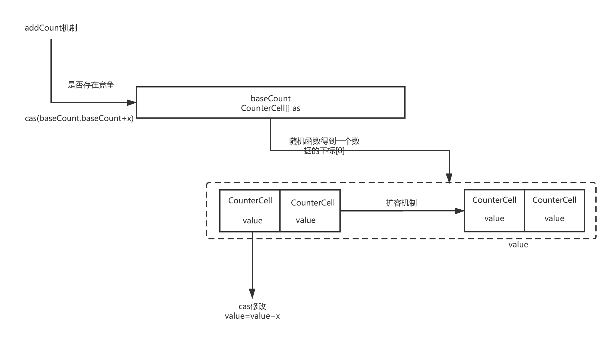

```java
// 在没有竞争(cas判断)的情况下,去通过cas操作更新元素个数
private transient volatile long baseCount;
// 在存在竞争的情况下,存储元素个数
private transient volatile CounterCell[] counterCells;
// x=1 check==0 hash不冲突| 1 hash链表 | 2 红黑树 
// check什么时候为负数? 删除元素吗?
private final void addCount(long x, int check) {
    CounterCell[] as; long b, s;
    // 当counterCells分段统计表为null,或者修改基础统计变量baseCount失败时(cas判断存在竞争时)
    if ((as = counterCells) != null ||
        //  1-通过cas修改baseCount个数
        !U.compareAndSwapLong(this, BASECOUNT, b = baseCount, s = b + x)) {
        CounterCell a; long v; int m;
        boolean uncontended = true;
        if (as == null || (m = as.length - 1) < 0 ||
            // 计算出下标为null,说明下标还没有初始化
            (a = as[ThreadLocalRandom.getProbe() & m]) == null ||
            // 2- 通过随机算法找到countCells[]下标,通过cas修改counterCells[random]的value=value+x;
            !(uncontended =
              U.compareAndSwapLong(a, CELLVALUE, v = a.value, v + x))) {
            // 3- 初始化countCells[] | 扩容
            fullAddCount(x, uncontended);
            return;
        }
        // 如果不是红黑树,不需要分段统计
        if (check <= 1)
            return;
        // 分段统计
        s = sumCount();
    }
    // 第四阶段:扩容
    if (check >= 0) {
        Node<K,V>[] tab, nt; int n, sc;
        while (s >= (long)(sc = sizeCtl) && (tab = table) != null &&
               (n = tab.length) < MAXIMUM_CAPACITY) {
            int rs = resizeStamp(n);
            if (sc < 0) {
                if ((sc >>> RESIZE_STAMP_SHIFT) != rs || sc == rs + 1 ||
                    sc == rs + MAX_RESIZERS || (nt = nextTable) == null ||
                    transferIndex <= 0)
                    break;
                if (U.compareAndSwapInt(this, SIZECTL, sc, sc + 1))
                    transfer(tab, nt);
            }
            else if (U.compareAndSwapInt(this, SIZECTL, sc,
                                         (rs << RESIZE_STAMP_SHIFT) + 2))
                transfer(tab, null);
            // 分段统计
            s = sumCount();
        }
    }
}
// sumSize = baseCount + (遍历counterCells[]数组每个counterCells中value的值)
final long sumCount() {
    CounterCell[] as = counterCells; CounterCell a;
    long sum = baseCount;
    if (as != null) {
        for (int i = 0; i < as.length; ++i) {
            if ((a = as[i]) != null)
                sum += a.value;
        }
    }
    return sum;
}
```

fullAddCount

```java
private final void fullAddCount(long x, boolean wasUncontended) {
    int h;	// 随机数
    if ((h = ThreadLocalRandom.getProbe()) == 0) {
        ThreadLocalRandom.localInit();      // force initialization
        h = ThreadLocalRandom.getProbe();
        wasUncontended = true;
    }
    boolean collide = false;                // True if last slot nonempty
    for (;;) {
        CounterCell[] as; CounterCell a; int n; long v;
        // 看源码不需要按照顺序看,if分为三大段,初始化-> 赋值
        // 2- 随机函数计算下标,该下标CounterCell对象为null时,new CounterCell并赋值,不为null时尝试cas赋值,赋值失败则扩容
        if ((as = counterCells) != null && (n = as.length) > 0) {
            // a=as[(n - 1) & h])计算出下标位置
            // 2-1 a == null 还没有初始化,初始化a并赋值
            if ((a = as[(n - 1) & h]) == null) {
                if (cellsBusy == 0) {            // Try to attach new Cell
                    CounterCell r = new CounterCell(x); // Optimistic create
                    if (cellsBusy == 0 &&
                        U.compareAndSwapInt(this, CELLSBUSY, 0, 1)) {
                        boolean created = false;
                        try {               // Recheck under lock
                            CounterCell[] rs; int m, j;
                            if ((rs = counterCells) != null &&
                                (m = rs.length) > 0 &&
                                rs[j = (m - 1) & h] == null) {
                                rs[j] = r;
                                created = true;
                            }
                        } finally {
                            cellsBusy = 0;
                        }
                        if (created)
                            break;
                        continue;           // Slot is now non-empty
                    }
                }
                collide = false;
            }
            else if (!wasUncontended)       // CAS already known to fail
                wasUncontended = true;      // Continue after rehash
            // 2-2 通过cas修改值a
            else if (U.compareAndSwapLong(a, CELLVALUE, v = a.value, v + x))
                break;
            else if (counterCells != as || n >= NCPU)
                collide = false;            // At max size or stale
            else if (!collide)
                collide = true;
            // 修改失败,最后到这里,说明竞争很激烈,需要扩容
            // 2-3 扩容
            else if (cellsBusy == 0 &&
                     U.compareAndSwapInt(this, CELLSBUSY, 0, 1)) {
                try {
                    if (counterCells == as) {// Expand table unless stale
                        CounterCell[] rs = new CounterCell[n << 1];
                        for (int i = 0; i < n; ++i)
                            rs[i] = as[i];
                        counterCells = rs;
                    }
                } finally {
                    cellsBusy = 0;
                }
                collide = false;
                continue;                   // Retry with expanded table
            }
            h = ThreadLocalRandom.advanceProbe(h);
        }
        // 1- 表示当前线程获得初始化资格
        // cellsBusy乐观锁:保证 CounterCell[] 初始化的安全性
        // 初始化CounterCell[]并且赋值
        else if (cellsBusy == 0 && counterCells == as &&
                 U.compareAndSwapInt(this, CELLSBUSY, 0, 1)) {
            boolean init = false;
            try {                           // Initialize table
                if (counterCells == as) {
                    CounterCell[] rs = new CounterCell[2];
                    rs[h & 1] = new CounterCell(x);
                    counterCells = rs;
                    init = true;
                }
            } finally {
                cellsBusy = 0; // 释放锁
            }
            if (init)
                break;
        }
        // 3- 扩容后赋值失败,尝试baseCount
        else if (U.compareAndSwapLong(this, BASECOUNT, v = baseCount, v + x))
            break;                          // Fall back on using base
    }
}
```


4- 触发协助扩容,

```java
final Node<K,V>[] helpTransfer(Node<K,V>[] tab, Node<K,V> f) {
    Node<K,V>[] nextTab; int sc;
    if (tab != null && (f instanceof ForwardingNode) &&
        (nextTab = ((ForwardingNode<K,V>)f).nextTable) != null) {
        int rs = resizeStamp(tab.length);
        while (nextTab == nextTable && table == tab &&
               (sc = sizeCtl) < 0) {
            if ((sc >>> RESIZE_STAMP_SHIFT) != rs || sc == rs + 1 ||
                sc == rs + MAX_RESIZERS || transferIndex <= 0)
                break;
            if (U.compareAndSwapInt(this, SIZECTL, sc, sc + 1)) {
                transfer(tab, nextTab);
                break;
            }
        }
        return nextTab;
    }
    return table;
}
```


每一种情况具体的实现源码:

#### 1- 通过cas修改baseCount个数;

```java
if ((as = counterCells) != null ||
        //  1-通过cas修改baseCount个数
        !U.compareAndSwapLong(this, BASECOUNT, b = baseCount, s = b + x)) 
```

#### 2- 通过随机算法找到countCells[]下标,通过cas修改counterCells[random]的value=value+x;

```java
 if (as == null || (m = as.length - 1) < 0 ||
     // 计算出下标为null,说明下标还没有初始化
     (a = as[ThreadLocalRandom.getProbe() & m]) == null ||
     // 2- 通过随机算法找到countCells[]下标,通过cas修改counterCells[random]的value=value+x;
     // 进入到这行代码说明countCells[]不为null
     !(uncontended =
       U.compareAndSwapLong(a, CELLVALUE, v = a.value, v + x))) {
     ...
 }
```

#### 3-1 初始化countCells[]并赋值

```java
else if (cellsBusy == 0 && counterCells == as &&
         U.compareAndSwapInt(this, CELLSBUSY, 0, 1)) {
    boolean init = false;
    try {                           // Initialize table
        if (counterCells == as) {
            CounterCell[] rs = new CounterCell[2];
            rs[h & 1] = new CounterCell(x);
            counterCells = rs;
            init = true;
        }
    } finally {
        cellsBusy = 0; // 释放锁
    }
    if (init)
        break;
}
```

#### 3-2 随机函数计算下标,该下标CounterCell对象为null时,new CounterCell并赋值,不为null时尝试cas赋值,赋值失败则扩容

- 下标CounterCell对象为null时,new CounterCell并赋值

  ```java
  if ((a = as[(n - 1) & h]) == null) {
      if (cellsBusy == 0) {            // Try to attach new Cell
          CounterCell r = new CounterCell(x); // Optimistic create
          if (cellsBusy == 0 &&
              U.compareAndSwapInt(this, CELLSBUSY, 0, 1)) {
              boolean created = false;
              try {               // Recheck under lock
                  CounterCell[] rs; int m, j;
                  if ((rs = counterCells) != null &&
                      (m = rs.length) > 0 &&
                      rs[j = (m - 1) & h] == null) {
                      rs[j] = r;
                      created = true;
                  }
              } finally {
                  cellsBusy = 0;
              }
              if (created)
                  break;
              continue;           // Slot is now non-empty
          }
      }
      collide = false;
  }
  ```

- 下标CounterCell对象为不null时,cas赋值

  ```java
   else if (U.compareAndSwapLong(a, CELLVALUE, v = a.value, v + x))
       break;
  ```

- 赋值失败则扩容

  ```java
  else if (cellsBusy == 0 &&
           U.compareAndSwapInt(this, CELLSBUSY, 0, 1)) {
      try {
          if (counterCells == as) {// Expand table unless stale
              CounterCell[] rs = new CounterCell[n << 1];
              for (int i = 0; i < n; ++i)
                  rs[i] = as[i];
              counterCells = rs;
          }
      } finally {
          cellsBusy = 0;
      }
      collide = false;
      continue;                   // Retry with expanded table
  }
  ```

### 第四阶段:扩容阶段(元素个数大于阈值的时候)

扩容触发条件:

1- 当元素大于阈值的时候 sizeCtl

2- 如果此时正在扩容,在扩容阶段进来的线程会协助扩容


扩容实现:

数据迁移(高低位迁移)

helpTransfer()协助扩容,职责划分[区间]

```java
 static final int NCPU = Runtime.getRuntime().availableProcessors();
private final void transfer(Node<K,V>[] tab, Node<K,V>[] nextTab) {
    int n = tab.length, stride;
    if ((stride = (NCPU > 1) ? (n >>> 3) / NCPU : n) < MIN_TRANSFER_STRIDE)
        stride = MIN_TRANSFER_STRIDE; // subdivide range
    if (nextTab == null) {            // initiating
        try {
            @SuppressWarnings("unchecked")
            Node<K,V>[] nt = (Node<K,V>[])new Node<?,?>[n << 1];
            nextTab = nt;
        } catch (Throwable ex) {      // try to cope with OOME
            sizeCtl = Integer.MAX_VALUE;
            return;
        }
        nextTable = nextTab;
        transferIndex = n;
    }
    int nextn = nextTab.length;
    ForwardingNode<K,V> fwd = new ForwardingNode<K,V>(nextTab);
    boolean advance = true;
    boolean finishing = false; // to ensure sweep before committing nextTab
    for (int i = 0, bound = 0;;) {
        Node<K,V> f; int fh;
        while (advance) {
            int nextIndex, nextBound;
            if (--i >= bound || finishing)
                advance = false;
            else if ((nextIndex = transferIndex) <= 0) {
                i = -1;
                advance = false;
            }
            else if (U.compareAndSwapInt
                     (this, TRANSFERINDEX, nextIndex,
                      nextBound = (nextIndex > stride ?
                                   nextIndex - stride : 0))) {
                bound = nextBound;
                i = nextIndex - 1;
                advance = false;
            }
        }
        if (i < 0 || i >= n || i + n >= nextn) {
            int sc;
            if (finishing) {
                nextTable = null;
                table = nextTab;
                sizeCtl = (n << 1) - (n >>> 1);
                return;
            }
            if (U.compareAndSwapInt(this, SIZECTL, sc = sizeCtl, sc - 1)) {
                if ((sc - 2) != resizeStamp(n) << RESIZE_STAMP_SHIFT)
                    return;
                finishing = advance = true;
                i = n; // recheck before commit
            }
        }
        else if ((f = tabAt(tab, i)) == null)
            advance = casTabAt(tab, i, null, fwd);
        else if ((fh = f.hash) == MOVED)
            advance = true; // already processed
        else {
            synchronized (f) {
                if (tabAt(tab, i) == f) {
                    Node<K,V> ln, hn;
                    if (fh >= 0) {
                        int runBit = fh & n;
                        Node<K,V> lastRun = f;
                        for (Node<K,V> p = f.next; p != null; p = p.next) {
                            int b = p.hash & n;
                            if (b != runBit) {
                                runBit = b;
                                lastRun = p;
                            }
                        }
                        if (runBit == 0) {
                            ln = lastRun;
                            hn = null;
                        }
                        else {
                            hn = lastRun;
                            ln = null;
                        }
                        for (Node<K,V> p = f; p != lastRun; p = p.next) {
                            int ph = p.hash; K pk = p.key; V pv = p.val;
                            if ((ph & n) == 0)
                                ln = new Node<K,V>(ph, pk, pv, ln);
                            else
                                hn = new Node<K,V>(ph, pk, pv, hn);
                        }
                        setTabAt(nextTab, i, ln);
                        setTabAt(nextTab, i + n, hn);
                        setTabAt(tab, i, fwd);
                        advance = true;
                    }
                    else if (f instanceof TreeBin) {
                        TreeBin<K,V> t = (TreeBin<K,V>)f;
                        TreeNode<K,V> lo = null, loTail = null;
                        TreeNode<K,V> hi = null, hiTail = null;
                        int lc = 0, hc = 0;
                        for (Node<K,V> e = t.first; e != null; e = e.next) {
                            int h = e.hash;
                            TreeNode<K,V> p = new TreeNode<K,V>
                                (h, e.key, e.val, null, null);
                            if ((h & n) == 0) {
                                if ((p.prev = loTail) == null)
                                    lo = p;
                                else
                                    loTail.next = p;
                                loTail = p;
                                ++lc;
                            }
                            else {
                                if ((p.prev = hiTail) == null)
                                    hi = p;
                                else
                                    hiTail.next = p;
                                hiTail = p;
                                ++hc;
                            }
                        }
                        ln = (lc <= UNTREEIFY_THRESHOLD) ? untreeify(lo) :
                        (hc != 0) ? new TreeBin<K,V>(lo) : t;
                        hn = (hc <= UNTREEIFY_THRESHOLD) ? untreeify(hi) :
                        (lc != 0) ? new TreeBin<K,V>(hi) : t;
                        setTabAt(nextTab, i, ln);
                        setTabAt(nextTab, i + n, hn);
                        setTabAt(tab, i, fwd);
                        advance = true;
                    }
                }
            }
        }
    }
}
```


put方法中有两个地方会触发扩容:

```java
final V putVal(K key, V value, boolean onlyIfAbsent) {
	// ...
    for (Node<K,V>[] tab = table;;) {
        // ...
        if (binCount != 0) {
            if (binCount >= TREEIFY_THRESHOLD)
                // 触发扩容2 :: put -> putVal ->  treeifyBin -> tryPresize ->transfer
                treeifyBin(tab, i);
            if (oldVal != null)
                return oldVal;
            break;
        }
    }
    // 触发扩容1 :: put -> putVal -> addCount -> transfer
    addCount(1L, binCount);
    return null;
}
```

- 触发扩容1 :  在元素统计方法AddCount中触发扩容

  sizeCtl 有多重意义:

  1 扩容阈值 未初始化node[]时为0; 初始化为12;

  2 代表当前参与扩容的线程 当有线程正在扩容时,sizeCtl<0;

  ​	高位表示当前长度下唯一的扩容标记

  ​	低位表示协助扩容的线程数量,有一个线程参与扩容低位+1,扩容结束,低位-1.当低位-2=0的时候,表示扩容结束.

```java
private static final int MAXIMUM_CAPACITY = 1 << 30;
private static int RESIZE_STAMP_BITS = 16;
private static final int RESIZE_STAMP_SHIFT = 32 - RESIZE_STAMP_BITS;
static final int resizeStamp(int n) {
    // 非0位前面0个数 :: n==16时, Integer.numberOfLeadingZeros(16) == 27
    // 27 | 1 << 15 = 27|32768 = 27+32768 = 32795
    // 32795的32位二进制 : 0000 0000 0000 0000 1000 0000 0001 1011
    // 1000 0000 0001 1100
    return Integer.numberOfLeadingZeros(n) | (1 << (RESIZE_STAMP_BITS - 1));
}
private final void addCount(long x, int check) {
    // ...
    if (check >= 0) {
        Node<K,V>[] tab, nt; int n, sc;
        while (s >= (long)(sc = sizeCtl) && (tab = table) != null &&
               (n = tab.length) < MAXIMUM_CAPACITY) {
            int rs = resizeStamp(n); // 扩容戳值
            // _1 当sc(sizeCtl)<0的时候,表示有其他的线程在扩容
            if (sc < 0) {
                // _1-1 表示不需要扩容
                if ((sc >>> RESIZE_STAMP_SHIFT) != rs || sc == rs + 1 ||
                    sc == rs + MAX_RESIZERS || (nt = nextTable) == null ||
                    transferIndex <= 0)
                    break;
                // _1-2 表示协助扩容
                if (U.compareAndSwapInt(this, SIZECTL, sc, sc + 1))
                    // 触发扩容1-1
                    transfer(tab, nt);
            }
            // _2 表示当前没有线程在扩容
            // (rs << RESIZE_STAMP_SHIFT) + 2 
            // 0000 0000 0000 0000 1000 0000 0001 1011左移16位,地位变高位
            // 1000 0000 0001 1011(扩容标记) 0000 0000 0000 0000,因此sizeCtrl < 0
            // 标记参与扩容的线程 1000 0000 0001 1011 0000 0000 0000 0010
            else if (U.compareAndSwapInt(this, SIZECTL, sc,
                                         (rs << RESIZE_STAMP_SHIFT) + 2))
                // 触发扩容1-2
                transfer(tab, null);
            // 分段统计
            s = sumCount();
        }
    }
     // ...
}
```

- 触发扩容2 : 在hash链表转换红黑树结构中扩容

```java
private final void treeifyBin(Node<K,V>[] tab, int index) {
    Node<K,V> b; int n, sc;
    if (tab != null) {
        if ((n = tab.length) < MIN_TREEIFY_CAPACITY)
            // 触发扩容2
            tryPresize(n << 1);
        else if ((b = tabAt(tab, index)) != null && b.hash >= 0) {
            //...
        }
    }
}
```

```java
private final void tryPresize(int size) {
    int c = (size >= (MAXIMUM_CAPACITY >>> 1)) ? MAXIMUM_CAPACITY :
    tableSizeFor(size + (size >>> 1) + 1);
    int sc;
    while ((sc = sizeCtl) >= 0) {
        Node<K,V>[] tab = table; int n;
        if (tab == null || (n = tab.length) == 0) {
            n = (sc > c) ? sc : c;
            if (U.compareAndSwapInt(this, SIZECTL, sc, -1)) {
                try {
                    if (table == tab) {
                        @SuppressWarnings("unchecked")
                        Node<K,V>[] nt = (Node<K,V>[])new Node<?,?>[n];
                        table = nt;
                        sc = n - (n >>> 2);
                    }
                } finally {
                    sizeCtl = sc;
                }
            }
        }
        else if (c <= sc || n >= MAXIMUM_CAPACITY)
            break;
        else if (tab == table) {
            int rs = resizeStamp(n);
            if (sc < 0) {
                Node<K,V>[] nt;
                if ((sc >>> RESIZE_STAMP_SHIFT) != rs || sc == rs + 1 ||
                    sc == rs + MAX_RESIZERS || (nt = nextTable) == null ||
                    transferIndex <= 0)
                    break;
                if (U.compareAndSwapInt(this, SIZECTL, sc, sc + 1))
                    // 触发扩容2-1
                    transfer(tab, nt);
            }
            else if (U.compareAndSwapInt(this, SIZECTL, sc,
                                         (rs << RESIZE_STAMP_SHIFT) + 2))
                // 触发扩容2-2
                transfer(tab, null);
        }
    }
}
```


疑惑:

1.  addCount(1L, binCount); 什么时候需要统计
2. f instanceof TreeBin 什么时候插入
3.  else if ((fh = f.hash) == MOVED)
               tab = helpTransfer(tab, f); 什么时候触发转换
4.   treeifyBin(tab, i); 如何转化tree


# 工具

## HSDIS工具：查看汇编指令

> 查看运行代码的汇编指令的工具.zip

1. 解压压缩文件放到`JRE_HOME/bin/server`路径下

   比如：C:\Program Files\Java\jdk1.8.0_202\jre\bin\server

2. 在运行main函数之前，加入虚拟机参数

> -server -Xcomp -XX:+UnlockDiagnosticVMOptions -XX:+PrintAssembly -XX:CompileCommand=compileonly,*App.getInstance（替换成实际运行的代码） 

